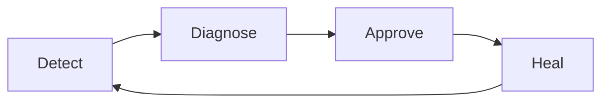
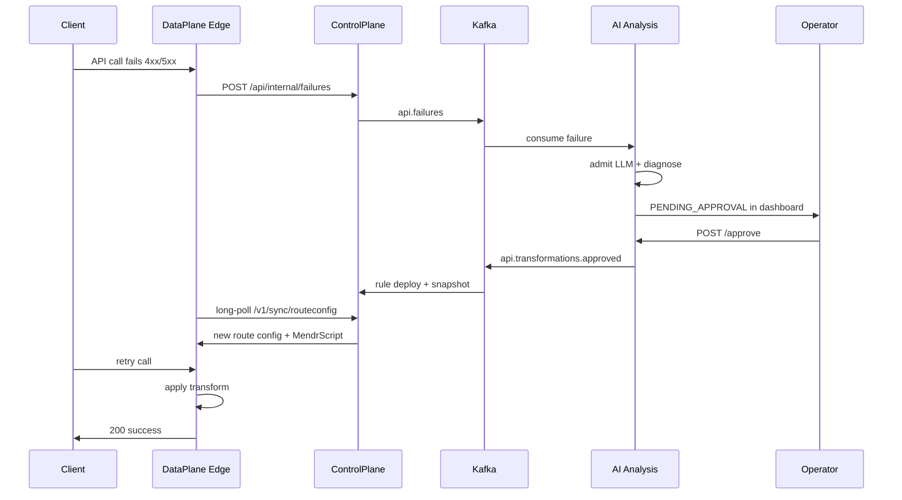
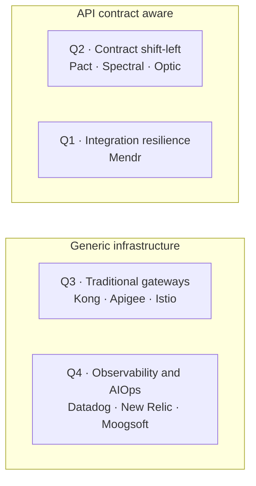
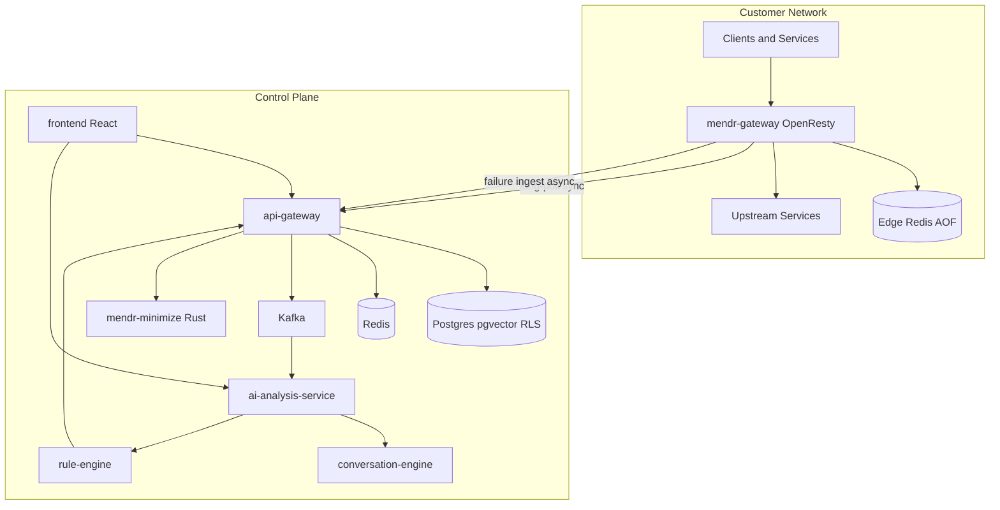
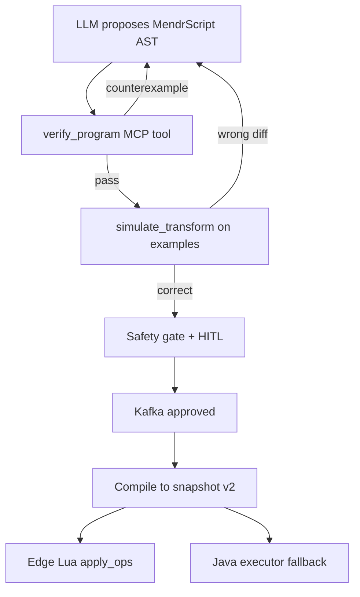
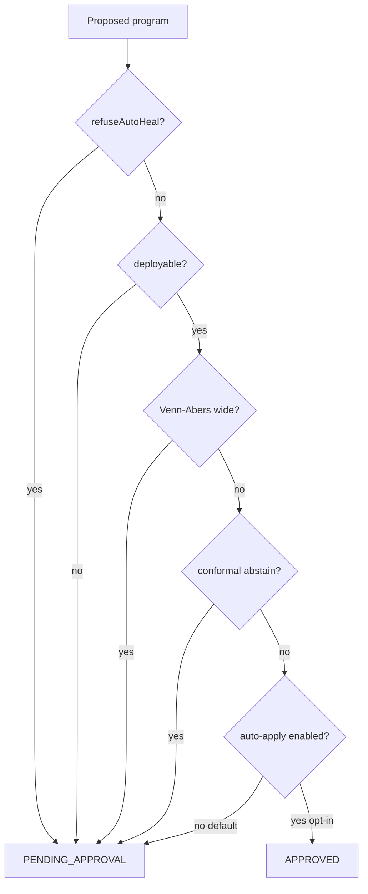
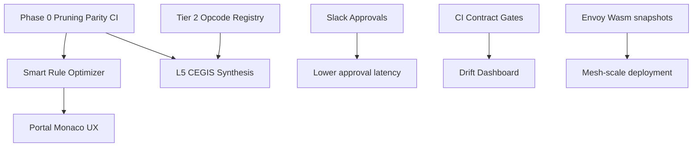

# Mendr Master Business Study

**Version:** 1.0  
**Date:** August 2026  
**Classification:** External — Enterprise & Investor  
**Repositories:** `mendr-control-plane`, `mendr-data-plane`

---

## Table of Contents

- [Part I — Executive Summary, Mission & Vision](#part-i--executive-summary-mission--vision)
  - [1.1 Executive Summary](#11-executive-summary)
  - [1.2 Mission Statement](#12-mission-statement)
  - [1.3 Vision](#13-vision)
  - [1.4 The Problem We Solve](#14-the-problem-we-solve)
  - [1.5 Product Overview — The Four-Step Loop](#15-product-overview--the-four-step-loop)
- [Part II — Value Proposition & Organizational Benefits](#part-ii--value-proposition--organizational-benefits)
  - [2.1 Benefits by Stakeholder](#21-benefits-by-stakeholder)
  - [2.2 Concrete Use Cases](#22-concrete-use-cases)
  - [2.3 Deployment Models](#23-deployment-models)
  - [2.4 Business Impact & ROI Framework](#24-business-impact--roi-framework)
  - [2.5 Developer Experience](#25-developer-experience)
- [Part III — Competitive Landscape & Moat](#part-iii--competitive-landscape--moat)
  - [3.1 Category Definition](#31-category-definition)
  - [3.2 Competitive Comparison Matrix](#32-competitive-comparison-matrix)
  - [3.3 Ten Defensible Moat Pillars](#33-ten-defensible-moat-pillars)
  - [3.4 Why Now](#34-why-now)
- [Part IV — Technology & Cutting-Edge Practices](#part-iv--technology--cutting-edge-practices)
  - [4.1 Two-Plane Architecture](#41-two-plane-architecture)
  - [4.2 Data Plane — Edge Gateway](#42-data-plane--edge-gateway)
  - [4.3 Control Plane — Intelligence Layer](#43-control-plane--intelligence-layer)
  - [4.4 MendrScript & Minimization](#44-mendrscript--minimization)
  - [4.5 Safety, Trust & Compliance](#45-safety-trust--compliance)
- [Part V — Roadmap & Strategic Outlook](#part-v--roadmap--strategic-outlook)
  - [5.1 Shipped Today](#51-shipped-today)
  - [5.2 Near-Term Roadmap](#52-near-term-roadmap)
  - [5.3 Medium-Term Roadmap](#53-medium-term-roadmap)
  - [5.4 Long-Term Vision](#54-long-term-vision)
- [Appendices](#appendices)
  - [Appendix A — Service & Port Matrix](#appendix-a--service--port-matrix)
  - [Appendix B — API Endpoint Inventory](#appendix-b--api-endpoint-inventory)
  - [Appendix C — Failure Category → Rule Type Mapping](#appendix-c--failure-category--rule-type-mapping)
  - [Appendix D — MendrScript Opcode Reference](#appendix-d--mendrscript-opcode-reference)
  - [Appendix E — Edge Capability Tokens](#appendix-e--edge-capability-tokens)
  - [Appendix F — Security & Multi-Tenancy Checklist](#appendix-f--security--multi-tenancy-checklist)
  - [Appendix G — Deployment Quick-Start](#appendix-g--deployment-quick-start)
  - [Appendix H — Glossary](#appendix-h--glossary)

---

# Part I — Executive Summary, Mission & Vision

## 1.1 Executive Summary

Modern enterprises run on APIs. Service-to-service calls carry orders, payments, inventory, identity, and customer data across dozens or hundreds of independently deployed systems. Each integration is a contract: a shared understanding of URLs, headers, field names, types, and response shapes. When those contracts drift — because a team renamed a field, tightened a schema, changed a route, or misconfigured CORS — the failure does not stay inside a log file. It becomes a failed checkout, a stuck shipment, a broken dashboard, or a silent data corruption that surfaces hours later in a war room.

**Mendr is a self-healing API platform** built to eliminate that class of customer-facing outage at the point where it occurs: the gateway layer, in real time, with human trust and machine verification.

Mendr sits in the path of service-to-service and ingress API traffic. It observes every call, detects integration failures the instant they happen, captures full request and response context, diagnoses root cause using AI constrained by contracts and topology, proposes a precise virtual patch, waits for human approval, and deploys that patch live at the edge — without application redeploys, without downtime, and without running raw LLM output on the hot path.

The platform is architected as **two cooperating planes**:


| Plane             | Repository            | Role                                                                                                                                                                                                                 |
| ----------------- | --------------------- | -------------------------------------------------------------------------------------------------------------------------------------------------------------------------------------------------------------------- |
| **Data plane**    | `mendr-data-plane`    | OpenResty/LuaJIT edge gateway + local Redis. Terminates traffic, applies WAF/auth/rate limits, executes verified MendrScript transforms at line rate, reports failures asynchronously.                               |
| **Control plane** | `mendr-control-plane` | Cloud or on-prem intelligence: service registry, OpenAPI onboarding, Kafka async analysis, LLM-assisted diagnosis under admission control, conformal safety gate, rule deploy, operator dashboard, developer portal. |


The design philosophy is captured in three principles documented in the control plane README:

1. **Deterministic over probabilistic** — Large language models propose hypotheses; output is constrained into closed-opcode MendrScript, minimized, verified, and gated. The edge never executes raw model text.
2. **Observe at the edge, decide in the control plane, enforce from a local snapshot** — Analysis is asynchronous via Kafka; the data plane keeps serving on last-known-good Redis snapshots even if the control plane or its Redis is temporarily degraded.
3. **Gate the model, not Kafka** — Over-budget or coalesced LLM work is acknowledged and deferred (metric + log), never nack-retried into an LLM cost storm.

For enterprise buyers, this translates into a concrete outcome: **integration failures that would previously require emergency hotfixes, rollbacks, or customer communication can be healed in minutes** — with an immutable audit trail, auto-expiring patches, and explicit human approval.

For investors, Mendr occupies a **new category** between API gateways (which route) and observability platforms (which detect). Observability tells you something broke. Gateways move bits. Mendr fixes broken traffic in production. That action layer — verified, gated, edge-local — is the product moat.

Proxy traffic does not traverse the control plane on every request. Customers deploy Mendr gateways in their own networks; gateways long-poll for route configuration snapshots and store them in local Redis with AOF persistence. Healing rules propagate in seconds. The control plane is the brain; the edge is the muscle that must keep flexing even when the brain is briefly unavailable.

This document is the master reference for any organization evaluating Mendr: executives seeking business outcomes, CTOs validating architecture, security teams reviewing trust boundaries, and investors assessing category creation and defensibility. Every capability described as "shipped" is grounded in the current `mendr-control-plane` and `mendr-data-plane` codebases. Roadmap items are explicitly labeled. Evaluators should treat Appendix O as a reading list for technical validation sessions lasting one to two days with engineering stakeholders from platform, security, and integration teams present.

---

## 1.2 Mission Statement

**Mission:** Eliminate customer-facing integration outages caused by schema drift, contract mismatch, routing errors, CORS failures, and response contract drift — by healing API traffic at the gateway layer in real time, with auditable human trust.

Mendr exists because the industry has optimized for two incomplete answers:

- **Detection without repair.** Application performance monitoring, log aggregation, and distributed tracing excel at telling operators that `inventory-service` returned 400 when calling `shipping-service` with field `tag_id` instead of `tag_sent`. They do not fix the call. Engineers still write patches, run CI, obtain approvals, deploy, and hope the blast radius is contained.
- **Routing without semantics.** API gateways and service meshes excel at TLS termination, load balancing, authentication, and rate limiting. They were not designed to rename a field, coerce a type, inject a default, or override a broken upstream route based on a diagnosed contract violation — safely, reversibly, and at streaming JSON throughput.

Mendr closes the gap with a **self-healing layer** that is neither a dashboard nor a passive proxy. It is an active remediation engine governed by policy.

### What Mendr is

- A **runtime integration resilience platform** that intercepts failed or failing API traffic and applies verified virtual patches until permanent fixes ship in upstream services.
- A **human-in-the-loop healing system** where auto-apply defaults to off; conformal prediction and Venn-Abers intervals determine when abstention is the correct answer.
- An **enterprise API gateway** with OpenAPI onboarding, transparent HTTP ingress, WAF, JWT/OIDC, rate limiting, AI gateway facade, developer portal, GitOps manifests, and multi-tenant isolation at the database row level.
- A **verified codegen pipeline** where MendrScript — a closed-opcode transform DSL — is compiled, simulated, minimized (Rust egg EqSat sidecar), and re-verified in Java before any edge deployment.

### What Mendr is not

- **Not another APM dashboard.** Mendr may ingest OTLP traces and surface failures in an operator UI, but its purpose is remediation, not visualization alone.
- **Not an iPaaS design-time tool.** Mendr operates in the production hot path; it does not require replumbing integrations in a separate design studio.
- **Not unconstrained AI auto-healing.** The conversation engine has no deploy node. LLM output never executes on the edge. Prompt injection cannot bypass the Java verifier.
- **Not a replacement for permanent fixes.** Virtual patches auto-expire. Mendr buys time and protects customers while engineering ships the real contract fix.

The mission aligns with the public positioning on the Mendr landing page: *"Services break in real-time. Mendr fixes them in real-time."* Behind that headline sits a deliberately conservative trust model — precisely because enterprises will only delegate healing authority to a system that proves correctness before action.

---

## 1.3 Vision

### Today: API gateway plus self-healing transform layer

Mendr today ships as a **hybrid-deployable platform**:

- **Control plane** runs as a Docker Compose stack (or cloud-hosted SaaS) with Postgres, Redis, Kafka, Java microservices, a Python LangGraph conversation engine, a Rust minimization sidecar, and a React operator dashboard.
- **Data plane** runs as an OpenResty gateway container with co-located edge Redis, deployable in customer VPCs, on-prem data centers, or developer laptops.

Customers register services via OpenAPI import or `mendr.yaml` manifests. The control plane compiles route configuration snapshots — including MendrScript programs, CORS policies, rate limits, WAF rules, AI routes, and ingress tables — and serves them to edges via long-poll sync. Edges proxy locally. Failures flow back asynchronously for AI analysis and human approval.

This is already a complete product loop: detect → diagnose → approve → heal → sync.

### Tomorrow: Enterprise mesh scale

The codebase explicitly anticipates expansion beyond a single OpenResty gateway per site:

- **Envoy and Istio sidecar federation** — Comments in `RouteConfigSnapshotPublisher.java` reference Envoy Wasm snapshot compatibility as a forward path. The landing page moat copy states Mendr scales "from an API gateway today to Envoy and Istio at enterprise scale tomorrow."
- **Multi-cluster federation** — Roadmap item on the marketing site; architecture supports per-tenant edge isolation and capability-gated sync that extends naturally to fleet management.
- **CI contract gates** — Complementary to runtime healing; prevent drift at build time while Mendr catches production drift CI missed.
- **Slack and Teams approval workflows** — Notification service exists; external integrations are near-term roadmap.

### North star: Integration resilience as infrastructure

The long-term vision is that **every API call self-corrects within policy bounds until the permanent fix ships**. Integration resilience becomes as assumed as TLS termination: not a project, not a runbook step, but infrastructure.

In that world:

- Schema renames in upstream services do not cause cascading outages because Mendr detects, proposes, and — upon approval — heals field mappings at the gateway within seconds.
- Cross-tenant anonymized precedent pools (opt-in, privacy-gated, schema already in Postgres migrations) allow Mendr to recognize failure signatures seen elsewhere and propose higher-confidence heals faster.
- Conformal auto-apply becomes available for organizations that opt in, gated by calibrated confidence intervals — never as an unchecked default.
- Sandboxed Lua shadow labs (Tier 3 MendrScript design) learn candidate primitives off the hot path; only human-promoted opcodes enter the closed registry.

Mendr's vision is not to replace engineering teams. It is to **remove integration failures from the critical path of customer experience** while preserving engineering ownership of permanent fixes, auditability, and security boundaries.

---

## 1.4 The Problem We Solve

### The combinatorial integration failure surface

When an organization adopts microservices, API-first architecture, or modular SaaS composition, it inherits a combinatorial integration surface. If `N` services each expose `M` endpoints, the number of potential caller-callee contract pairs grows faster than any team can manually regression-test before every deploy.

Failures manifest in recurring categories that Mendr's edge classifies and routes to specialized analysis:


| Failure category         | Typical symptom                                 | Business impact                               |
| ------------------------ | ----------------------------------------------- | --------------------------------------------- |
| **SCHEMA_MISMATCH**      | Unknown field, wrong type, validation 400       | Order submission fails; inventory sync breaks |
| **RESPONSE_MISMATCH**    | Downstream response shape differs from contract | Client parsers fail; mobile apps crash        |
| **ROUTING**              | Wrong host, DNS failure, 502/503                | Traffic black-holed; cascading retries        |
| **CORS / CORS_UPSTREAM** | Browser or gateway blocks cross-origin          | Frontend features silently fail               |
| **SPLICE**               | Streaming transform abort after partial flush   | Rare but severe — protocol-aware 502          |
| **UNKNOWN**              | Unclassified errors                             | Requires human triage                         |


Each category can originate from innocent changes: a developer renamed `tag_id`to `tag_sent` in inventory but shipping still expects the old name; a platform team tightened JSON Schema validation; a DevOps rotation pointed a service discovery entry to a decommissioned pod; a security team added CORS restrictions that block a legitimate BFF.

These are not exotic edge cases. They are **the steady-state tax of distributed systems**.

### Detection tools do not repair

The observability industry — Datadog, New Relic, Splunk, Sentry, Grafana stacks — has matured dramatically. Teams have dashboards, alerts, SLOs, and incident workflows. Yet the median incident timeline for an integration-class failure still looks like:

1. Alert fires (minutes to tens of minutes after first customer impact, depending on SLO coverage).
2. On-call assembles; traces and logs are searched.
3. Root cause identified: contract mismatch, not infrastructure outage.
4. Fix designed: change producer, change consumer, or add adapter code.
5. CI, review, deploy — often hours, sometimes days for change-adverse environments.
6. Postmortem documents "we need better contract testing" — again.

Mendr compresses steps 3–5 for a defined class of failures. The gateway already saw the failing request and response. AI analysis, constrained by OpenAPI contracts and service topology, proposes a transform. A human approves. The edge applies it on the next sync — **seconds to minutes**, not hours.

### Deploy latency versus production drift

Modern deployment pipelines are fast relative to historical release cycles, but they are still **slower than production drift**:

- Upstream SaaS vendors change APIs on their schedule.
- Partner integrations update without synchronized deploys.
- Feature flags expose new code paths that alter payloads.
- Database migrations change serialized field shapes.

Contract tests in CI catch many issues but cannot prove absence of drift in production. Pact, Optic, Spectral, and similar tools are valuable — and Mendr complements them by handling **what CI missed** (roadmap: first-class CI contract gates).

### The cost of integration incidents

Organizations pay for integration failures in ways that rarely appear on a single budget line:

- **Engineering opportunity cost** — Senior engineers in war rooms instead of product work.
- **Revenue leakage** — Failed checkouts, incomplete shipments, broken signup flows.
- **SLA credits and contractual penalties** — Especially in B2B platforms with uptime guarantees.
- **Customer trust erosion** — End users experience "the app is broken" without understanding microservices.
- **Compliance exposure** — Incidents involving PII mishandling or audit gaps when emergency fixes bypass process.

Mendr targets the subset of these costs attributable to **repairable contract and routing failures at the API boundary** — a large and underserved slice.

---

## 1.5 Product Overview — The Four-Step Loop

Mendr's product is organized around a four-step loop that maps directly to implemented services and edge behavior.




### Step 1 — Detect

The data plane edge observes every proxied call. In the log phase (`log.lua`), failures trigger when HTTP status is 4xx/5xx or when a streaming splice transform aborts after partial response flush (category `SPLICE`).

Before reporting, the edge:

- Classifies the failure (`classify_failure`)
- Dedupes via atomic shared-memory add on `fail:{source}:{target}:{endpoint}:{category}` (60-second window)
- Redacts PII (`pii_redact.lua` — SSN, card numbers, emails, bearer tokens, password keys)
- POSTs asynchronously to `POST /api/internal/failures` on the control plane

The control plane ingests via `FailureIngestionService`, applies tenant-scoped Redis dedup, persists to Postgres, and publishes to Kafka topic `api.failures`.

**Key insight for buyers:** Detection is edge-local and asynchronous. It does not add per-request control-plane latency.

### Step 2 — Diagnose

The `ai-analysis-service` consumes failure events under **LLM admission control** (`LlmAdmissionControl.java`):

- Assembles an `ErrorSignature` with contract context, topology, and GraphRAG precedents
- Coalesces duplicate analysis requests (Redis key with 30-second TTL default)
- Limits concurrent LLM calls (semaphore default: 2)
- Enforces global (30/min) and per-tenant (10/min) budgets
- Defers over-budget work with Kafka ack — **never retries into an LLM storm**

Diagnosis may route through the **conversation-engine** (`POST /diagnose`) when configured. LangGraph orchestrates a VeriGuard-style loop: propose MendrScript → verify → simulate → refine. MCP tools supply context (precedents, ACE playbooks, repair heuristics, LILO skills, MetaMemory, EvolveMem retrieval config, compiled prompts).

Output is always a **closed-opcode MendrScript program** or a legacy typed rule — never freeform code.

Optional **minimization** via Rust sidecar `mendr-minimize` (ddmin → egg EqSat → prove_minimal) shrinks programs before presentation.

### Step 3 — Approve

The **safety gate** (`SafetyGateService.java`) evaluates every proposed heal:

- `refuseAutoHeal` → always `PENDING_APPROVAL`
- Non-deployable programs → `PENDING_APPROVAL` or `REJECTED`
- Wide Venn-Abers interval → `PENDING_APPROVAL`
- Conformal abstain → `PENDING_APPROVAL`
- Accept with auto-apply disabled (default) → `PENDING_APPROVAL`
- Accept with auto-apply enabled (opt-in) → `APPROVED`

**Auto-apply defaults off.** Operators review proposals in the dashboard (`/analysis`), inspect confidence bars, chat with the synthesis engine, and approve or reject.

Approval publishes to Kafka `api.transformations.approved`. The rule-engine deploys to Postgres, evicts Redis cache, commits precedents to pgvector, and triggers snapshot republication.

Chat-synthesized programs submitted via `POST /api/analysis/{id}/program` are **re-verified server-side** before staging — the conversation engine cannot bypass Java authority.

### Step 4 — Heal

`RouteConfigSnapshotPublisher` materializes approved rules into capability-gated JSON snapshots. Edges long-poll `GET /v1/sync/routeconfig?since=&caps=` (approximately 30-second hold → 304 or payload).

On sync, the edge:

- Writes route configs to local Redis (`mendr:routeconfig:{source}:{target}:{endpoint}`)
- Rebuilds ingress radixtrees (multi-worker with lock + last-known-good fallback)
- Applies request transforms before upstream call; response transforms in `body_filter`
- Chooses **streaming splice** or **DOM buffer** based on plan class

Subsequent calls through the healed route succeed without upstream code changes. Patches auto-expire per rule TTL. Permanent fixes remain the engineering team's responsibility.

### End-to-end lifecycle diagram




This loop — **observe at the edge, decide in the control plane, enforce from a local snapshot** — is Mendr's core product mechanism and the phrase that should anchor every customer conversation.

---

# Part II — Value Proposition & Organizational Benefits

## 2.1 Benefits by Stakeholder

Mendr delivers differentiated value across the executive and engineering hierarchy. The following table maps stakeholders to concrete, code-backed outcomes — not aspirational marketing claims.


| Stakeholder                 | Primary pain                                      | Mendr outcome                                                                                          | Evidence in platform                             |
| --------------------------- | ------------------------------------------------- | ------------------------------------------------------------------------------------------------------ | ------------------------------------------------ |
| **CTO / VP Engineering**    | P1 integration incidents erode release confidence | Virtual patches heal contract failures in minutes; permanent fix decoupled from customer impact window | Four-step loop; auto-expiring rules; audit trail |
| **Platform / SRE**          | Gateway outages during control-plane incidents    | Edge serves from LKG Redis snapshots; Java fallback for cold start                                     | `sync_client.lua`, `MENDR_JAVA_FALLBACK`         |
| **API / Integration leads** | OpenAPI drift across teams                        | Import OpenAPI/manifests; GitOps push; developer portal                                                | `ServiceRegistryController`, `/api/portal/`*     |
| **Security / GRC**          | AI auto-remediation risk                          | HITL default; conformal abstention; FORCE RLS; PII scrub at edge                                       | `SafetyGateService`, `docs/SECURITY.md`          |
| **Product / CS**            | Customer-visible broken flows                     | Approved heals restore traffic without customer-facing deploy                                          | Edge transform before upstream                   |
| **FinOps**                  | LLM cost storms during incidents                  | Admission control coalesce/defer; no Kafka retry storms                                                | `LlmAdmissionControl.java`                       |


### CTO and VP Engineering

Chief technology officers care about **incident frequency, mean time to recovery, and engineering velocity**. Integration-class P1 incidents are especially painful because they rarely implicate a single team. Producer and consumer both point fingers; the gateway layer often has the clearest view of the mismatch but historically no authority to fix it.

Mendr gives the CTO a governed mechanism to **stop emergency redeploys for transient contract mismatches**. When inventory renames `tag_id` to `tag_sent` but shipping still expects the old field, Mendr proposes a `move` or `rename` MendrScript program. After approval, the edge transforms payloads on the `/ship` route. Customers keep shipping while teams schedule the proper upstream fix.

The audit trail (`audit_log`, rule-engine `/api/rules/audit`, dashboard `/audit`) satisfies compliance questions: who approved what patch, when, for which route, with what verification proof stored in `transform_programs`.

Auto-expiring patches ensure virtual fixes do not become permanent undocumented adapters — a common failure mode of ad-hoc gateway scripts.

### Platform engineering and SRE

Site reliability engineers need systems that **degrade gracefully**. Mendr's split-plane architecture is deliberate:

- Proxy traffic stays on the edge except optional Java fallback (`proxy_core.delegate_to_java`)
- Edge Redis holds AOF-persisted snapshots; sync long-polls with 35-second timeout and 5-second error backoff
- Periodic full resync every 300 seconds (`MENDR_FULL_RESYNC_INTERVAL_SEC`) backstops missed deltas
- Ingress radixtree rebuild uses worker lock + LKG — failed rebuild does not advance local version; stale tree continues serving
- Circuit breaker, active healthcheck, `proxy_next_upstream` retries (5× on 502/503/504)

Observability hooks include Prometheus `/metrics` on the edge, OTLP span export (`otel.lua`), and control-plane analytics rollups (`/api/gateway/analytics/*`).

Failure dedup at the edge (`dedup.lua`) prevents telemetry storms during sustained outages — a practical SRE concern often ignored by naive "report every error" designs.

### API and integration teams

Integration teams live in OpenAPI specs, JSON Schema, and consumer-driven contracts. Mendr meets them where they work:

- **OpenAPI import** — `POST /api/services/import-openapi` (multipart, JSON, from-url)
- **Dry-run diff** — `POST /api/services/import-openapi/dry-run` previews changes without write
- **Manifest import** — `POST /api/services/import-manifest` for `mendr.yaml` GitOps workflows
- **Developer portal** — `/api/portal/`* for catalog, specs, API keys, usage, AI route configuration

Topology edges accumulate from manifest declarations, OpenAPI declarations, traffic observations, and code analysis (`init_v14_service_topology.sql`) — building a **service dependency graph** for blast-radius analysis without requiring Neo4j operations overhead.

### Security, GRC, and compliance

Security teams rightfully fear AI that "fixes production." Mendr's trust model addresses OWASP LLM Top 10 explicitly in `docs/SECURITY.md`:

- Prompt injection mitigated via immutable system prompts, action screening, closed opcode vocabulary
- No excessive agency — conversation engine has **no deploy node**
- Complete mediation — authorization in RLS and Java verifier, never delegated to LLM
- Sensitive field blacklist at edge (`transform.lua` `protected_violation`) independent of control plane
- PII scrubbed before failure reports leave customer network
- WorkOS JWT for humans; per-tenant API keys for edges (sha256 hashed at rest)
- FORCE Row Level Security on Postgres — unset tenant context matches zero rows

For GDPR and SOC2 programs, the combination of HITL approval, immutable audit, auto-expiry, and tenant isolation provides audit-ready artifacts.

### Product and customer success

Product managers and customer success teams experience integration failures as **support ticket spikes** and **NPS drops**. Mendr reduces customer-visible impact duration for approved heals from "until next deploy" to "until next sync" — typically seconds to minutes after operator approval.

The dashboard `/simulate` page offers pre-built scenarios (field rename, DNS routing, CORS, type mismatch) for demos and training — helping CS articulate value without production incidents.

---

## 2.2 Concrete Use Cases

Each use case follows the pattern: **business scenario → edge detection category → proposed remediation → time-to-heal → permanent fix path**.

### Use case 1: Field rename drift (SCHEMA_MISMATCH)

**Scenario:** The inventory team deploys a schema change renaming outbound shipment field `tag_id` to `tag_sent`. The shipping service validation still requires `tag_id`. Every inventory→shipping `POST /ship` returns HTTP 400.

**Detection:** Edge logs 400 response; `classify_failure` → `SCHEMA_MISMATCH`. Deduped failure report includes request/response payloads (PII-redacted) and route template.

**Diagnosis:** AI analysis compares payload against registered OpenAPI contracts for both services. ErrorSignature localizes jsonPath `/tag_id`. MendrScript proposal: `move` from `/tag_id` to `/tag_sent` or `rename` at parent level depending on structure. Minimizer may collapse redundant op sequences (roadmap: unified relocate fusion).

**Approval:** Safety gate → `PENDING_APPROVAL`. Operator reviews diff simulation in dashboard, approves.

**Heal:** Rule deploys as `DSL_PROGRAM` or legacy `FIELD_MOVE`. Snapshot sync version increments. Edge applies request transform via streaming splice if plan class permits.

**Time-to-heal:** Minutes from first failure to approved traffic restoration (dominated by human approval latency, not deploy mechanics).

**Permanent fix:** Shipping service updates validation schema; Mendr rule expires via TTL.

### Use case 2: Type coercion (SCHEMA_MISMATCH)

**Scenario:** Payment service sends `amount` as string `"19.99"`; billing expects JSON number. Validation fails.

**Detection:** 400 with schema validation error body.

**Diagnosis:** Category `SCHEMA_MISMATCH`, change type type mismatch. MendrScript `coerce` op on `/amount` to `number`.

**Heal:** Edge `coerce_strict` in `transform.lua` fail-closed on non-numeric strings.

**Permanent fix:** Payment team fixes serializer; coerce rule expires.

### Use case 3: Missing required field (SCHEMA_MISMATCH)

**Scenario:** Legacy client omits optional-on-their-side field `region` that downstream now requires.

**Diagnosis:** `default` op with policy `on: ABSENT` or `coalesce` chain.

**Heal:** Edge injects default (e.g., `"US"`) on absent path.

**Governance note:** Defaults on critical business fields should require explicit operator approval — conformal gate enforces caution on wide uncertainty intervals.

### Use case 4: Wrong upstream routing (ROUTING)

**Scenario:** Service discovery entry points to decommissioned host; 502/503 responses.

**Detection:** Category `ROUTING`.

**Diagnosis:** Topology RCA enumerates candidate paths from Postgres SCD2 graph; proposes `ROUTING_OVERRIDE` to healthy instance pool.

**Heal:** Snapshot updates `targetBaseUrl` or routing rule; `peer_resolver` uses updated pool with healthcheck filtering.

**Permanent fix:** Platform team fixes service registry / DNS.

### Use case 5: CORS block (CORS / CORS_UPSTREAM)

**Scenario:** Browser-facing BFF blocked by new CORS policy on upstream API.

**Detection:** Category `CORS` or `CORS_UPSTREAM` with preflight failure metadata.

**Diagnosis:** Proposes `CORS_ALLOW` or `CORS_ORIGIN_OVERRIDE` rule synced into snapshot (no per-request control-plane call).

**Heal:** Edge applies CORS headers in `header_filter` per synced policy.

**Permanent fix:** Upstream adds proper `Access-Control-Allow-Origin`.

### Use case 6: Response contract drift (RESPONSE_MISMATCH)

**Scenario:** Downstream returns extra nesting or renamed response field breaking mobile client parser — gateway sees 200 but validate-response flags mismatch.

**Detection:** Async `POST /api/internal/validate-response` from log phase when route has response contract.

**Diagnosis:** Response-side MendrScript program (often DOM-classified due to response transform complexity).

**Heal:** Response transform in `body_filter` reshapes payload before client receives it.

**Permanent fix:** API version negotiation (`Accept-Version` / sunset headers supported) plus client update.

### Use case 7: AI gateway abuse

**Scenario:** Customer exposes LLM facade through Mendr AI gateway route; prompt injection or token burn attack.

**Detection:** Rate limit counters, jailbreak pattern matches in `ai_gateway.lua`.

**Mitigation (shipped):** TPM/RPM limits, prompt firewall, semantic cache for repeated queries, PII redaction policies on AI routes (`init_v17b_ai_gateway.sql`).

**Differentiation:** Mendr combines self-healing with **AI gateway governance** in one edge — not a separate product bolt-on.

### Use case 8: Streaming transform safety (SPLICE)

**Scenario:** Large JSON response requires structural rename at streaming throughput; splice scanner fault after partial flush.

**Detection:** Category `SPLICE`; edge aborts with protocol-aware 502 and RFC 9457 problem detail — **even if upstream returned 200**.

**Operational value:** Fail-closed behavior prevents torn pages reaching clients — a subtle but critical enterprise requirement rarely offered by DIY JSON middleware.

---

## 2.3 Deployment Models

Mendr supports multiple deployment topologies aligned with enterprise security and latency requirements.

### Model A — SaaS control plane + customer edge (hybrid)

**Description:** Control plane hosted by Mendr (or customer VPC cloud account); data plane gateway deployed in each customer network close to services.

**Traffic flow:** Application calls → local edge `:8080` → upstream services. Sync and failure telemetry to control plane over HTTPS with per-tenant `GATEWAY_EDGE_API_KEY`.

**When to choose:** Default for production; minimizes data-plane latency; keeps payload healing local; satisfies data residency for request/response bodies (only redacted failure samples leave edge per policy).

**Configuration highlights:**

- Edge: `MENDR_CONTROL_PLANE_URL`, `GATEWAY_EDGE_API_KEY`, optional `MENDR_TENANT_ID`
- CP: tenant-scoped snapshot publishing, WorkOS auth for dashboard

### Model B — Full on-prem stack

**Description:** Both planes via `docker compose up -d --build` in customer data center.

**When to choose:** Air-gapped environments, regulated industries requiring no external SaaS dependency, development and POC clusters.

**Components:** All services in control plane README plus local edge from data plane repo.

### Model C — Degraded / resilience modes

**Java fallback:** When edge lacks route snapshot or ingress tree not ready, envelope requests delegate to control plane Java proxy (`MENDR_JAVA_FALLBACK=true` default in config).

**LKG serving:** Stale ingress radixtree continues during rebuild failure; alert threshold 1 hour (`STALE_ALERT_SEC`).

**Control plane outage:** Edge continues proxying with last synced rules; new heals unavailable until CP returns — existing approved transforms keep working.

---

## 2.4 Business Impact & ROI Framework

Mendr does not publish customer-specific ROI figures in this document. Instead, we provide a **worksheet framework** organizations can populate with their own assumptions.

### Variables


| Variable | Description                                                | Your value |
| -------- | ---------------------------------------------------------- | ---------- |
| `I`      | Integration-class P1/P2 incidents per year                 | ___        |
| `H`      | Average hours to restore via deploy/rollback               | ___        |
| `E`      | Fully loaded engineer cost per hour                        | ___        |
| `R`      | Average revenue at risk per hour during incident           | ___        |
| `P`      | Percent of integration incidents Mendr can heal (`0–100%`) | ___        |
| `M`      | Mendr mean time to heal after approval (hours)             | ~0.05–0.5  |


### Cost of status quo (annual)

```
Incident_cost = I × H × (E + R)
```

### Cost with Mendr (annual, simplified)

```
Healed_incidents = I × (P/100)
Unhealed_incidents = I - Healed_incidents
Mendr_incident_cost = Unhealed_incidents × H × (E + R) + Healed_incidents × M × (E + R)
Savings = Incident_cost - Mendr_incident_cost - Mendr_platform_cost
```

### Non-quantified benefits

- **Reduced war-room fatigue** — on-call engineers approve verified patches instead of debugging from scratch at 3am
- **Faster partner onboarding** — OpenAPI import + virtual patches bridge version gaps during migration windows
- **Compliance confidence** — audit trail for every virtual patch
- **LLM cost control** — admission gate prevents runaway inference bills during failure storms

---

## 2.5 Developer Experience

Mendr invests in operator and developer UX through the React dashboard (`frontend/`, port 3000).

### Dashboard routes (shipped)


| Route       | Capability                                                            |
| ----------- | --------------------------------------------------------------------- |
| `/`         | Overview stats, trends                                                |
| `/failures` | Paginated failure list, detail modal                                  |
| `/analysis` | HITL queue, Venn-Abers confidence, approve/reject, SSE chat synthesis |
| `/rules`    | Active rules by type (schema, routing, CORS, origin override)         |
| `/services` | Service registration, OpenAPI/manifest import, upstream instances     |
| `/portal`   | Developer portal — catalog, specs, keys, usage                        |
| `/simulate` | Pre-built failure scenarios                                           |
| `/audit`    | Deploy/approve/disable history                                        |


### Chat-synthesized MendrScript

Operators converse with the conversation-engine via SSE (`/api/chat/stream` proxied through frontend nginx with buffering disabled, 120s timeout). Proposed programs attach via `POST /api/analysis/{id}/program` with **mandatory server-side re-verify** before staging.

LangGraph graph (`conversation-engine/app/graph.py`) implements propose → verify → simulate → refine — no deploy node.

### Auth

WorkOS AuthKit when `REACT_APP_WORKOS_CLIENT_ID` configured; transparent dev passthrough when not. Bearer token on all API clients and SSE.

---

# Part III — Competitive Landscape & Moat

## 3.1 Category Definition

Mendr defines a new category: **integration resilience** — the capability to detect, diagnose, and repair broken API traffic in production at the gateway boundary, with verified transforms and human governance.

This category sits between:

- **API gateways** (Kong, Apigee, AWS API Gateway, Azure APIM) — traffic management, authentication, rate limiting
- **Service meshes** (Istio, Linkerd, Envoy) — L7 routing, mTLS, observability hooks
- **Observability** (Datadog, Splunk, New Relic, Grafana) — detection, dashboards, alerting
- **Integration platforms** (MuleSoft, Boomi) — design-time orchestration and connectors

None of these categories alone delivers **verified live payload healing** as a first-class product loop. Gateways can route malformed requests to dead endpoints. Observability can alert on schema validation failures. iPaaS can redesign integrations offline. Mendr **fixes the bytes in flight** after diagnosis, before the client sees failure — subject to approval.

### Positioning statement

From the Mendr landing page:

> *"Observability tools tell you something broke. API gateways route traffic. Mendr is the only layer that fixes broken traffic in production — with human-in-the-loop trust and a control plane that scales from an API gateway today to Envoy and Istio at enterprise scale tomorrow."*

This is accurate to the implementation: the edge transform engine (`transform.lua`, `splice.lua`) executes approved programs; observability integrations (OTLP ingest, metrics) are supplementary.

### Buyer mental model

When evaluating Mendr, buyers should ask: **"What happens after the alert?"** If the answer is still "engineer writes code, CI runs, deploy waits," Mendr fills the gap. If the answer is already "we manually edit gateway scripts without verification," Mendr upgrades that practice to verified MendrScript with audit and safety gates.

---

## 3.2 Competitive Comparison Matrix

The following comparisons are honest about competitor strengths. Mendr wins on **closed-loop healing**; competitors win on maturity dimensions where Mendr is younger.

### API gateways (Kong, Apigee, AWS API Gateway, Gravitee)


| Dimension          | They win                                            | Mendr wins                                        |
| ------------------ | --------------------------------------------------- | ------------------------------------------------- |
| Ecosystem maturity | Plugins, marketplace, years of production hardening | Self-healing loop with AI diagnosis               |
| Policy breadth     | Extensive auth, quota, transformation plugins       | Verified MendrScript + minimizer + conformal gate |
| Transformation     | Request/response mapping (often manual config)      | AI-proposed, simulated, approved transforms       |
| Operations model   | Per-route manual maintenance                        | Failure-driven proposals with precedent learning  |


**Takeaway:** Mendr can coexist as a specialized healing layer in front of or alongside existing gateways during migration; long-term vision includes Envoy sidecar parity.

### Service meshes (Istio, Linkerd, Cilium)


| Dimension              | They win                  | Mendr wins                                   |
| ---------------------- | ------------------------- | -------------------------------------------- |
| mTLS, traffic shifting | First-class, kube-native  | Payload/schema healing meshes cannot perform |
| Observability hooks    | Sidecar telemetry         | Contract-aware transforms on JSON bodies     |
| Routing                | Virtual services, subsets | Routing override heals + schema rename heals |


**Takeaway:** Mesh solves connectivity and policy; Mendr solves **semantic contract violations**. Complementary, not redundant.

### Observability (Datadog, New Relic, Splunk, Sentry)


| Dimension          | They win                             | Mendr wins                                   |
| ------------------ | ------------------------------------ | -------------------------------------------- |
| Breadth of signals | Logs, metrics, traces, RUM, profiles | Acts — deploys virtual patches               |
| ML on telemetry    | Anomaly detection, correlation       | Outputs executable MendrScript, not runbooks |
| Incident workflow  | PagerDuty integrations, on-call      | Reduces MTTR for integration class           |


**Takeaway:** Mendr ingests OTLP (`POST /api/internal/otlp/v1/traces`) but is not replacing APM — it **closes the remediation loop** APM leaves open.

### iPaaS / ESB (MuleSoft, Boomi, Workato)


| Dimension               | They win                          | Mendr wins                                             |
| ----------------------- | --------------------------------- | ------------------------------------------------------ |
| Design-time integration | Visual mapping, connector catalog | Runtime in-path healing without replumbing             |
| Batch / async workflows | Orchestration engines             | Sub-second heal deploy on live synchronous API traffic |
| Governance              | Enterprise integration COE        | HITL + MendrScript verification + audit                |


**Takeaway:** iPaaS is upstream/downstream of Mendr in many enterprises — Mendr catches production drift iPaaS models did not anticipate.

### API contract testing (Pact, Optic, Spectral, Schemathesis)


| Dimension             | They win                             | Mendr wins                                       |
| --------------------- | ------------------------------------ | ------------------------------------------------ |
| Shift-left prevention | CI contract gates                    | Production drift healing when CI missed          |
| Developer workflow    | PR checks, breaking change detection | Live traffic context with actual failing payload |


**Takeaway:** Mendr roadmap includes CI contract gates; today Mendr is the **production safety net**.

### AIOps (Moogsoft, BigPanda, ServiceNow AIOps)


| Dimension                | They win                           | Mendr wins                                        |
| ------------------------ | ---------------------------------- | ------------------------------------------------- |
| Multi-signal correlation | ITSM integration, enterprise sales | Domain-specific API contract healing              |
| Automation               | Runbook triggering                 | Verified codegen pipeline, not shell scripts      |
| AI safety                | Generic ML                         | Conformal abstention, closed opcodes, no edge LLM |


**Takeaway:** AIOps tells you which team to page; Mendr can **fix the API call** for a defined failure taxonomy.

### Competitive positioning diagram




```text
Competitive positioning axes (read with diagram above)

                    API contract aware
                           ↑
     Q2 Shift-left         |         Q1 Integration resilience
     Pact · Spectral       |         Mendr ★
     (CI prevention)       |         (live verified healing)
                           |
  Detection only ←---------+---------→ Remediation capable
                           |
     Q3 Gateways           |         Q4 APM / AIOps
     Kong · Apigee         |         Datadog · Moogsoft
     Istio · Envoy          |         (alert / runbook, not MendrScript)
                           |
                           ↓
                  Generic infrastructure
```

**How to read this chart**


| Quadrant              | Remediation | Contract focus | Examples                                                              |
| --------------------- | ----------- | -------------- | --------------------------------------------------------------------- |
| **Q1 — top-right**    | High        | High           | **Mendr** — heals live traffic with verified MendrScript              |
| **Q2 — top-left**     | Low         | High           | Pact, Spectral — shift-left contract gates, not runtime repair        |
| **Q3 — bottom-left**  | Low         | Low            | Kong, Apigee, Istio — route and policy, not failure-driven transforms |
| **Q4 — bottom-right** | Partial     | Low            | Datadog, Moogsoft — detect and correlate, not verified edge deploy    |


---

## 3.3 Ten Defensible Moat Pillars

Each pillar includes: **what it is**, **why it is hard to copy**, and **code evidence**.

### Pillar 1 — Verified codegen pipeline

**What:** LLMs propose MendrScript AST with closed opcodes; Java `MendrScriptVerifier` and `MendrScriptExecutor` simulate; Rust `mendr-minimize` shrinks; edge Lua interprets precompiled snapshots — never raw model output.

**Why hard to copy:** Requires coordinated DSL design across Java, Rust, and Lua with parity fixtures and CI gates. Bolt-on "AI fix" features lack minimization, cross-runtime equivalence, and fail-closed edge semantics.

**Evidence:** `docs/mendrscript-dynamic-rules-plan.md`, `mendr-minimize/README.md`, `transform.lua` `apply_ops`, conversation-engine README "complete mediation."

### Pillar 2 — Formal safety gate

**What:** Conformal prediction + Venn-Abers intervals gate auto-apply; wide intervals → abstention → HITL; auto-apply defaults off.

**Why hard to copy:** Demands calibration data pipeline (`conformal_calibration`, `init_v16_confidence_calibration.sql`) integrated into deploy decision, not bolted post-hoc.

**Evidence:** `SafetyGateService.java`, `mendr.conformal.auto-apply-enabled:false` default.

### Pillar 3 — Edge streaming transform engine

**What:** HBM JSON splice scanner (`splice.lua`) with plan-class classification (`PASSTHROUGH` through `UNBOUNDED`); protocol-aware abort after partial flush; pointer-trie cache in `mendr_splice_trie`.

**Why hard to copy:** Rare in gateways; requires deep nginx phase discipline, hold-until-EOF semantics for value-mutating ops, HTTP/1 vs HTTP/2 abort differences.

**Evidence:** `body_filter.lua`, `plan_class.lua`, data plane README streaming section.

### Pillar 4 — Learning stack depth

**What:** Beyond naive RAG — GraphRAG precedents (pgvector), ACE playbooks, ExpeL repair heuristics, LILO skills, MetaMemory, EvolveMem retrieval config, GEPA/MIPRO prompt compilation, Thompson bandits — exposed as MCP tools to analysis.

**Why hard to copy:** Years of integrated schema evolution (`init_v6` through `init_v17`); not a single prompt engineering hack.

**Evidence:** `ContextToolExecutor.java`, Postgres migration table in control plane README.

### Pillar 5 — Zero-hallucination topology RCA

**What:** Service dependency graph in Postgres SCD2; deterministic recursive CTEs for blast radius, root cause paths, cycles; optional RCA narrative selects only from enumerated paths with symbolic re-verification.

**Why hard to copy:** Avoids Neo4j ops burden while enforcing **abstention** when paths cannot be verified; LLM cannot invent topology edges.

**Evidence:** `docs/SERVICE_TOPOLOGY_RCA.md`, `init_v14_service_topology.sql`, `rca_narrative.py` (off by default).

### Pillar 6 — Cross-tenant drift corpus (opt-in)

**What:** Privacy-gated anonymized precedent sharing across tenants when explicitly opted in with attestation.

**Why hard to copy:** Network effects from failure signature corpus; requires legal/privacy architecture upfront (`CrossTenantController`, `MENDR_CROSS_TENANT_ENABLED` default false).

**Evidence:** `phase7_cross_tenant` migration, `CrossTenantAnonymizerTest.java`.

### Pillar 7 — Capability-gated sync contract

**What:** Edges advertise `v2,ingress,traffic,ratelimit,authz,cache,metrics,ai,waf,splice`; control plane withholds incompatible snapshot fields rather than silent no-op.

**Why hard to copy:** Prevents subtle production bugs where old edges ignore new opcodes; explicit contract between planes.

**Evidence:** `SyncController.java`, `sync_client.lua` `EDGE_CAPS`, README capability section.

### Pillar 8 — Defense-in-depth multi-tenancy

**What:** FORCE RLS Postgres + Redis `t:{tenantId}:` prefix + Kafka tenant headers + per-tenant API keys + sync scoped snapshots.

**Why hard to copy:** Single-layer app filtering is common; three-layer isolation with fail-closed RLS is enterprise-grade.

**Evidence:** `docs/MULTI_TENANCY.md`, `TenantKeys.java`, `TenantAwareDataSource`.

### Pillar 9 — LLM storm protection

**What:** Coalesce duplicate analyses; semaphore; budget counters; defer with ack — never Kafka nack retry storm.

**Why hard to copy:** Counter-intuitive to "retry until success" async patterns; requires product-level admission control design.

**Evidence:** `LlmAdmissionControl.java`, README Kafka hygiene, `mendr_analysis_deferred_total` metric.

### Pillar 10 — Dual-runtime parity

**What:** Java executor, Lua edge interpreter, Rust minimization oracle share semantics; parity fixtures in `mendr-minimize/fixtures/parity_cases.json` and Lua specs.

**Why hard to copy:** Most gateways have one runtime; maintaining three with CI gates is expensive but creates trust.

**Evidence:** `mendr-minimize/README.md`, `spec/transform_ops_spec.lua` (roadmap: permanent CI gate).

---

## 3.4 Why Now

Three macro trends make Mendr timely:

**1. API-first maturity.** Enterprises have completed microservices adoption sufficient to feel integration pain acutely — the problem is no longer "should we decompose" but "how do we keep contracts aligned at scale."

**2. LLM reliability concerns.** Raw LLM output on production paths is unacceptable; buyers demand verified, gated AI. Mendr's 2026-aligned design (language-is-the-sandbox, VeriGuard verified codegen) matches security advisory climate around LuaJIT sandboxing and prompt injection.

**3. Edge deployment renaissance.** Customer-owned edges (VPC gateways, on-prem OpenResty) regained popularity for latency and data residency — Mendr's hybrid model matches this infrastructure fashion.

**4. Cost consciousness.** LLM inference during incidents can explode without admission control — Mendr treats inference as a gated resource, not unlimited.

These trends collectively increase willingness to pay for **action-oriented infrastructure** that respects AI cost and security constraints — Mendr's design assumptions align with buyer psychology in 2026 enterprise procurement cycles rather than fighting against it. Platform engineering leaders now budget for integration resilience as distinct from observability and gateway spend. Mendr is positioned to capture that budget line directly today.

---

# Part IV — Technology & Cutting-Edge Practices

## 4.1 Two-Plane Architecture

Mendr's architecture separates **latency-sensitive enforcement** from **latency-tolerant intelligence**. This is not an accidental microservices split — it encodes the product philosophy that proxy traffic must survive control-plane maintenance windows.




### Design principles

**Deterministic over probabilistic.** Probabilistic components (LLM diagnosis) sit behind admission control and produce inputs to deterministic components (verifier, compiler, edge interpreter). The edge execution path is fully deterministic given a snapshot version.

**Observe at the edge, decide in the control plane, enforce locally.** Kafka decouples detection from analysis. Snapshot sync decouples approval from enforcement. Edge Redis makes enforcement local.

**Gate the model, not Kafka.** Message bus health must not couple to LLM vendor rate limits. Deferred analysis is a first-class outcome, not an error retry loop.

### Async versus sync boundaries


| Interaction            | Pattern                       | Latency impact on proxy          |
| ---------------------- | ----------------------------- | -------------------------------- |
| Proxy request/response | Sync on edge                  | None from CP                     |
| Failure report         | Async timer POST              | None                             |
| Route sync             | Long-poll background worker 0 | None                             |
| AI analysis            | Kafka consumer                | None                             |
| Operator approval      | HTTPS to CP                   | None until next sync             |
| Java fallback          | Sync HTTPS to CP              | Adds CP RTT — degraded mode only |


---

## 4.2 Data Plane — Edge Gateway

Repository: `mendr-data-plane`. Runtime: **OpenResty** (nginx + LuaJIT).

### Hot path execution order

From `proxy_core.lua`, each request traverses:

1. Route snapshot resolution — Redis key `mendr:routeconfig:{source}:{target}:{endpoint}` with radixtree template matching
2. Java fallback if `syncValidation`, missing snapshot, or unresolved URL
3. API version negotiation — Accept-Version / sunset → 406/410
4. OTel span start
5. WAF — geo/IP/body-size/builtin OWASP-inspired rules + optional Coraza CRS
6. Auth — JWT/OIDC JWKS verify
7. Rate limit — route policy + tenant quota + abuse/bot detection
8. AI gateway — TPM/RPM, prompt firewall, semantic cache short-circuit
9. Response cache HIT for GET/HEAD
10. Strict undeclared surface check from OpenAPI-derived allowed surface
11. CORS / origin override
12. Request transform — `transform.apply_program()` if request program non-empty
13. Upstream resolution — `peer_resolver.prepare()` with LB algorithms (RR, weighted, consistent hash), canary, mirror, circuit breaker
14. Request body write per `body_output_mode`
15. Header hygiene — strip internal headers; propagate trace context
16. `proxy_pass` to concrete URL or `mendr_dynamic` balancer
17. `header_filter` — CORS, correlation IDs, response body policy
18. `body_filter` — streaming splice or DOM transform
19. `log` — failure reports, validate-response, edge observations, metrics, usage, OTel export

### Two front doors


| Mode                | Entry                                          | Use case                                                            |
| ------------------- | ---------------------------------------------- | ------------------------------------------------------------------- |
| Envelope            | `POST /api/gateway/proxy`                      | SDK/mesh JSON envelope with explicit source/target/endpoint         |
| Transparent ingress | `location /` when `MENDR_INGRESS_ENABLED=true` | Real HTTP host-based routing via `X-Mendr-Key` or host identity map |


### MendrScript execution — plan classes

Programs re-classified on edge (`plan_class.lua`):

`PASSTHROUGH` < `PREFILTERABLE` < `FORWARD_ONLY` < `BOUNDED_WINDOW` < `UNBOUNDED`


| Class                         | Execution strategy                                        |
| ----------------------------- | --------------------------------------------------------- |
| PASSTHROUGH                   | No transform overhead                                     |
| PREFILTERABLE                 | Literal pre-scan; skip transform if miss                  |
| FORWARD_ONLY / BOUNDED_WINDOW | `splice.lua` HBM streaming rewrite                        |
| UNBOUNDED / conditionals      | Buffer full body → DOM `transform.apply_program`          |
| Splice fault before flush     | Spill to DOM or original                                  |
| Splice fault after flush      | Protocol-aware abort; failure report even on upstream 200 |


**Bounded window cap:** 256KB in `splice.lua`.

Conditionals always execute on DOM — scanner cannot evaluate predicates (intentional).

### Security at edge

- **Protected paths blacklist** in `transform.lua` — refuses programs touching `authorization`, `x-api-key`, `credit_card_number`, `internal_routing_id`, plus route-level `protectedPaths`
- **PII redaction** before telemetry leaves customer network
- **WAF modes:** off / detect / block per route or env
- **Bot detection** + nginx `limit_req` / `limit_conn` on ingress

### Sync and multi-worker ingress

Worker 0 long-polls control plane. Every worker calls `ingress_routing.ensure_fresh()` before match:

- Shared `last_version` vs local version comparison
- Rebuild lock (`shared:add`, 5s TTL)
- Winner reloads from Redis; loser waits or serves LKG
- Pair rebuild failure rolls back local version; hosts still update

Specs: `spec/ingress_sync_spec.lua`, CI workflow `.github/workflows/lua-specs.yml`.

### Observability

- Prometheus `GET /metrics`
- OTLP export to `MENDR_OTEL_ENDPOINT`
- Usage metering to Redis keys `mendr:usage:{tenant}:day:{YYYYMMDD}` (disable via `MENDR_USAGE_METERING=false`)

---

## 4.3 Control Plane — Intelligence Layer

Repository: `mendr-control-plane`. Primary languages: **Java 21 (Spring Boot 3)**, **Python (FastAPI + LangGraph)**, **Rust** (minimizer), **React 18** (dashboard).

### Service responsibilities


| Service              | Port | Function                                                                                                             |
| -------------------- | ---- | -------------------------------------------------------------------------------------------------------------------- |
| api-gateway          | 8095 | Registry, snapshots, sync, failure ingest, Java proxy, portal, GitOps, internal MendrScript verify/simulate/minimize |
| ai-analysis-service  | 8082 | Kafka failure consumer, LLM admission, safety gate, conformal, learning MCP tools                                    |
| conversation-engine  | 8085 | SSE chat, `/diagnose`, embeddings, GEPA compile hooks                                                                |
| rule-engine          | 8084 | Approved rule storage, disable, audit, precedent commit                                                              |
| notification-service | 8083 | Kafka consumer; HTTP denyAll                                                                                         |
| mendr-minimize       | 8099 | Rust ddmin + egg EqSat + prove_minimal                                                                               |
| frontend             | 3000 | Operator dashboard nginx → backend proxies                                                                           |


Infrastructure: Postgres 15 pgvector, Redis 7, Kafka 7.4 + Zookeeper.

### Service registry and onboarding

- CRUD services, contracts, upstream instances, health-check hooks
- OpenAPI import (multipart, JSON, URL) with dry-run diff
- Manifest import for `mendr.yaml` GitOps (`POST /api/gateway/gitops/manifest`)
- Topology edges from manifest, OpenAPI, traffic observations, code analysis

### Kafka pipeline

Topics:

- `api.failures` → ai-analysis-service
- `api.analysis.results` → notification-service
- `api.transformations.approved` → rule-engine → snapshot republish

Consumer hygiene: concurrency=1, max.poll.records=5, max.poll.interval.ms=600000 — prevents LLM work from blocking partition rebalance dangerously.

### LangGraph conversation engine

`conversation-engine/app/graph.py` orchestrates MendrScript synthesis:

- MCP tools for context (precedents, playbooks, heuristics, skills, meta-memory, retrieval config)
- Nodes: propose → verify_program → simulate_transform → refine (metamorphic property checks)
- **No deploy node** — architectural guarantee

SSE streaming via `POST /chat/stream` for dashboard interactivity.

Machine diagnosis via `POST /diagnose` when `MENDR_CONVERSATION_DIAGNOSE_URL` configured on analysis service.

### Rule deploy path

`ApprovalEventConsumer.java`:

- Handles legacy rule types (FIELD_RENAME, TYPE_COERCE, ROUTING_OVERRIDE, CORS_*, etc.)
- Handles `DSL_PROGRAM` MendrScript deployments
- Commits precedents to pgvector for GraphRAG recall
- Triggers `RouteConfigSnapshotPublisher` → tenant Redis → edge sync

### Enterprise gateway features (control plane compiled → edge enforced)

From migrations `init_v17_gateway_policies.sql`, `init_v17b_ai_gateway.sql`:

- Rate limit policies API
- AI gateway routes (tokens/min, jailbreak block, PII redact, semantic cache)
- Upstream load balancer instance pools
- Analytics rollups and audit endpoints

---

## 4.4 MendrScript & Minimization

MendrScript is Mendr's **closed-opcode transform DSL** (`schemaVersion: mendrscript/v1`).

### Why a DSL instead of plugins

The design plan (`docs/mendrscript-dynamic-rules-plan.md`) documents the motivation: fixed rule types required Java + Lua + DB enum + consumer branch for every new capability. MendrScript lifts transforms into composable programs while keeping the hot path safe — **no LLM-generated Lua** (LuaJIT sandbox unsafe per 2026 advisories and Mike Pall guidance).

Three tiers planned:

- **Tier 1 (shipped):** Verified MendrScript — closed opcodes, Java + Lua execution
- **Tier 2 (partial/planned):** Governed opcode registry — human-promoted new opcodes
- **Tier 3 (planned):** Sandboxed Lua shadow lab — off hot path, learning only

### Initial opcode set

**Structural:** `rename`, `move`, `copy`, `remove`, `wrap`, `unwrap`, `wrap_array`, `unwrap_array`, `strip_unknown`

**Value:** `default`, `coalesce`, `coerce`, `scale`, `arith`, `map_value`, `reformat_date`, `string`

**Control:** `conditional` with structured predicates (`eq`, `exists`, `in`, `regex-match` — no free-form code)

Legacy bucket form still supported: `moves`, `renames`, `defaults`, `coercions`, `coalesce`, `removals`, `scales`, `valueMaps`, `dateFormats`, `stripUnknown`, `wrapArrays`, `unwrapArrays`, `wrapKey`, `unwrapKey`.

### Verification loop (VeriGuard-style)




### Minimization (`mendr-minimize`)

Rust sidecar layers (`mendr-minimize/README.md`):

1. **necessity (ddmin)** — drop unneeded ops; ternary oracle Pass/Fail/Unresolved; never drops ops on `oneOf`/`anyOf` paths spuriously
2. **eqsat (egg)** — `MsLang` rewrite rules: compose rename/move, wrap/unwrap cancel, coerce shadow, dead-default+remove
3. **prove_minimal** — SyGuS-lite subsequence search + adjacent reorderings + CEGIS k≤8

Java gateway sets `fellBack` when sidecar down; always re-verifies minimized output.

**Roadmap (planned):** Interactive optimizer with pruning parity CI across Lua/Java/Rust; unified `Relocate` node; `POST /api/v1/rules/optimize`; Portal Monaco UX — see smart rule optimizer plan.

---

## 4.5 Safety, Trust & Compliance

### Human-in-the-loop by construction

The conversation engine cannot deploy. Chat output flows through:

1. Server-side Java `MendrScriptVerifier` re-verify on attach
2. Safety gate decision
3. Operator approve/reject
4. Kafka → rule-engine → snapshot

This satisfies enterprise change management: **virtual patches are governed changes**, not shadow IT scripts.

### Safety gate flow




### Edge fail-closed semantics

- Protected path violations refuse program at edge regardless of CP approval
- Coerce strict errors on non-coercible values
- Splice after-flush abort prevents torn JSON pages
- JWT verification fail-closed when JWKS required

### Compliance artifacts

- Append-only audit log (rule-engine)
- `transform_programs` stores AST + verification proof + simulation diffs
- Auto-expiring patch TTL on rules
- RCA faithfulness audit tables for narrative SLO evidence (when narrative enabled)

### Security stack summary

See Appendix F for full checklist from `docs/SECURITY.md` and `docs/MULTI_TENANCY.md`.

---

# Part V — Roadmap & Strategic Outlook

## 5.1 Shipped Today

The following capabilities are **implemented and verifiable** in the current `mendr-control-plane` and `mendr-data-plane` repositories as of this document.

### Data plane (shipped)

- [x] OpenResty/LuaJIT gateway with envelope and transparent ingress modes
- [x] Local edge Redis AOF snapshot cache
- [x] Long-poll route config sync with capability tokens
- [x] MendrScript transform — legacy buckets + closed-opcode `ops[]` v2
- [x] Streaming splice JSON rewrite with plan-class safety
- [x] DOM transform fallback for UNBOUNDED and conditional programs
- [x] Protocol-aware splice abort + SPLICE failure category
- [x] WAF — builtin OWASP-inspired rules + optional Coraza CRS
- [x] JWT/OIDC authentication with JWKS cache
- [x] Rate limiting, abuse detection, bot detection
- [x] AI gateway — TPM/RPM, prompt firewall, semantic cache
- [x] Load balancing — RR, weighted, consistent hash; canary; mirroring
- [x] Circuit breaker + active healthcheck
- [x] Response cache L1 shared dict
- [x] Failure telemetry with PII scrub and dedup
- [x] Async validate-response and edge topology observations
- [x] OTLP trace export + Prometheus metrics
- [x] Usage metering to Redis
- [x] Java fallback for cold/degraded edges
- [x] Multi-worker ingress sync with LKG fallback
- [x] Optional ACME TLS, mTLS, HTTP/3 entrypoint configs
- [x] Lua unit specs + GitHub Actions CI

### Control plane (shipped)

- [x] Service registry with OpenAPI and manifest import + dry-run
- [x] GitOps manifest push API
- [x] Failure ingestion + Kafka pipeline
- [x] LLM admission control (coalesce, semaphore, budgets, defer-with-ack)
- [x] Category-aware AI analysis (SCHEMA_MISMATCH, ROUTING, CORS, etc.)
- [x] Conformal + Venn-Abers safety gate (auto-apply default off)
- [x] MendrScript verify, simulate, compile, deploy (`DSL_PROGRAM`)
- [x] Rust minimization sidecar (ddmin + egg + prove_minimal)
- [x] LangGraph conversation engine + SSE chat + `/diagnose`
- [x] MCP tool surface for learning stack context
- [x] Rule engine with audit log and disable
- [x] Precedent commit to pgvector
- [x] Service topology SCD2 graph + deterministic CTE queries
- [x] Optional RCA narrative (off by default)
- [x] Multi-tenant FORCE RLS + Redis/Kafka isolation
- [x] WorkOS JWT auth + per-tenant API keys
- [x] Operator dashboard (failures, analysis, rules, services, portal, simulate, audit)
- [x] Developer portal APIs
- [x] Enterprise gateway policies — rate limits, AI routes, analytics
- [x] Cross-tenant pool schema (opt-in, default off)
- [x] Docker Compose full stack deployment
- [x] Security CI — gitleaks, Trivy, CodeQL, npm/pip audit

---

## 5.2 Near-Term Roadmap

Items below are **planned or partially implemented** — not marketed as GA unless noted.


| Item                                   | Description                                                                    | Status                                        |
| -------------------------------------- | ------------------------------------------------------------------------------ | --------------------------------------------- |
| **Smart rule optimizer**               | EqSat relocate fusion, candidate generator, `POST /optimize`, Portal Monaco UX | Planned — design in smart_rule_optimizer plan |
| **Pruning parity CI**                  | Align empty-parent delete semantics across Lua, Java, Rust; shared fixtures    | Planned — Phase 0 blocker                     |
| **MendrScript Tier 2 opcode registry** | Governed opcode discovery and human promotion                                  | Design doc; partial                           |
| **Slack / PagerDuty notifications**    | Wire notification-service beyond structured log placeholder                    | Near — placeholder exists                     |
| **Per-tenant warm publish on boot**    | Snapshot republish for all tenants on startup                                  | Documented gap                                |
| **gRPC-Web transcoding**               | Envoy transcoder integration                                                   | Comment in data plane                         |
| **Edge observation batching**          | Shared dict batch flush for topology observations                              | Comment in log.lua                            |
| **Frontend API key management UI**     | Self-service key rotation in dashboard                                         | Optional — documented gap                     |
| **Debate stability signal (s₇)**       | Additional safety gate input                                                   | Stub in SafetyGateService                     |
| **Cross-tenant anonymizer job**        | Background job for opt-in pool                                                 | Schema exists; job missing                    |
| **GEPA full multi-generation compile** | Prompt compilation                                                             | Partial; MIPRO fallback                       |
| **Targeted per-service healthcheck**   | Fine-grained HC API                                                            | Future iteration comment                      |


---

## 5.3 Medium-Term Roadmap

Derived from landing page future plans and architecture comments — **strategic intent**, not committed delivery dates.

### CI contract gates

Integrate Mendr contract validation into customer CI/CD (Spectral/Pact-like workflows) to prevent drift before production. Complements runtime healing — **shift-left plus shift-now**.

### Drift dashboard

Unified view of OpenAPI-declared versus traffic-observed versus healed-drift endpoints — leveraging topology SCD2 and failure analytics rollups.

### OpenAPI sync automation

Bi-directional sync between service registry and live OpenAPI specs in Git repositories — reducing manual import friction.

### Slack / Teams approval workflows

Push HITL approval cards to operator channels — accelerating approval latency without bypassing audit trail.

### Multi-cluster federation

Fleet management for edges across regions/clusters with consistent tenant policy — extends capability-gated sync model.

### Envoy / Istio sidecar snapshots

`RouteConfigSnapshotPublisher` Wasm comment — compile MendrScript programs for sidecar enforcement at mesh scale.

---

## 5.4 Long-Term Vision

**Integration resilience as infrastructure.** Every API boundary self-corrects within policy until permanent fixes ship.

**Cross-tenant anonymized precedent pool.** Opt-in customers contribute failure signatures that improve diagnosis for all — privacy-gated moat with network effects.

**Sandboxed Lua shadow lab (Tier 3).** Learn candidate primitives off hot path; only human-promoted opcodes enter registry — never LLM-generated Lua on edge.

**Opt-in conformal auto-apply.** Organizations with calibrated trust thresholds enable automatic deploy for narrow confidence bands — default remains HITL.

**Full mesh-native deployment.** Mendr heals at sidecar alongside Istio/Envoy traffic policies — same MendrScript semantics, different enforcement surface.

---

# Appendices

## Appendix A — Service & Port Matrix


| Port     | Service                     | Plane   |
| -------- | --------------------------- | ------- |
| 8080     | mendr-gateway (proxy)       | Data    |
| 6380     | mendr-edge-redis (host map) | Data    |
| 80 / 443 | Ingress + ACME (optional)   | Data    |
| 3000     | Operator dashboard          | Control |
| 8095     | api-gateway                 | Control |
| 8082     | ai-analysis-service         | Control |
| 8083     | notification-service        | Control |
| 8084     | rule-engine                 | Control |
| 8085     | conversation-engine         | Control |
| 8099     | mendr-minimize              | Control |
| 5432     | Postgres pgvector           | Control |
| 6379     | Redis                       | Control |
| 9092     | Kafka                       | Control |


---

## Appendix B — API Endpoint Inventory

### api-gateway (8095)


| Endpoint                                      | Purpose                  |
| --------------------------------------------- | ------------------------ |
| `POST /api/services`                          | Register service         |
| `GET/PUT/DELETE /api/services/{name}`         | Service CRUD             |
| `POST /api/services/import-openapi`           | OpenAPI onboarding       |
| `POST /api/services/import-openapi/dry-run`   | Preview import diff      |
| `POST /api/services/import-manifest`          | mendr.yaml import        |
| `POST /api/services/{name}/instances`         | Upstream pool management |
| `POST /api/gateway/proxy`                     | Java fallback proxy      |
| `GET /api/gateway/failures`                   | Failure list             |
| `POST /api/gateway/simulate-*`                | Simulation endpoints     |
| `GET/POST /api/gateway/rules`                 | Rule management          |
| `GET/POST /api/gateway/routing-rules`         | Routing rules            |
| `GET/POST /api/gateway/cors-rules`            | CORS rules               |
| `GET/POST /api/gateway/origin-override-rules` | Origin overrides         |
| `GET/POST /api/gateway/rate-limit-policies`   | Rate limit policies      |
| `GET/POST /api/gateway/ai-routes`             | AI gateway routes        |
| `POST /api/gateway/gitops/manifest`           | GitOps push              |
| `GET /api/gateway/analytics/*`                | Analytics rollups        |
| `GET /api/portal/*`                           | Developer portal         |
| `POST /api/internal/failures`                 | Edge failure ingest      |
| `POST /api/internal/edge-observations`        | Topology observations    |
| `POST /api/internal/otlp/v1/traces`           | OTLP ingest              |
| `POST /api/internal/mendrscript/verify`       | Verify program           |
| `POST /api/internal/mendrscript/simulate`     | Simulate transform       |
| `POST /api/internal/mendrscript/minimize`     | Minimize program         |
| `GET /v1/sync/routeconfig`                    | Edge snapshot sync       |
| `POST /api/internal/admin/api-keys`           | API key admin            |


### ai-analysis-service (8082)


| Endpoint                              | Purpose                     |
| ------------------------------------- | --------------------------- |
| `GET /api/analysis`                   | List analyses               |
| `GET /api/analysis/pending`           | HITL queue                  |
| `GET /api/analysis/{id}`              | Analysis detail             |
| `POST /api/analysis/{id}/approve`     | Approve heal                |
| `POST /api/analysis/{id}/reject`      | Reject proposal             |
| `POST /api/analysis/{id}/program`     | Stage chat program          |
| `GET /api/analysis/{id}/conversation` | Chat history                |
| `GET /api/analysis/stats`             | Dashboard statistics        |
| `POST /api/analysis/regression/run`   | Regression harness          |
| `GET/POST /api/analysis/gepa/*`       | GEPA compile status         |
| `POST /mcp`                           | MCP tools/list + tools/call |


### conversation-engine (8085)


| Endpoint                      | Purpose                   |
| ----------------------------- | ------------------------- |
| `POST /chat/stream`           | SSE MendrScript synthesis |
| `POST /diagnose`              | Machine diagnosis         |
| `POST /internal/embed`        | ErrorSignature embeddings |
| `POST /internal/gepa/compile` | Offline prompt compile    |
| `GET /health`                 | Health check              |


### rule-engine (8084)


| Endpoint                 | Purpose         |
| ------------------------ | --------------- |
| `GET /api/rules`         | List rules      |
| `GET /api/rules/active`  | Active rules    |
| `GET /api/rules/{id}`    | Rule detail     |
| `DELETE /api/rules/{id}` | Disable rule    |
| `GET /api/rules/stats`   | Rule statistics |
| `GET /api/rules/audit`   | Audit log       |


### mendr-minimize (8099)


| Endpoint         | Purpose                      |
| ---------------- | ---------------------------- |
| `POST /minimize` | Minimize MendrScript program |
| `GET /health`    | Health check                 |


---

## Appendix C — Failure Category → Rule Type Mapping


| Edge category     | Typical HTTP signal       | Analysis focus               | Common rule types / ops                                        |
| ----------------- | ------------------------- | ---------------------------- | -------------------------------------------------------------- |
| SCHEMA_MISMATCH   | 400 validation            | Request/req body vs contract | `rename`, `move`, `coerce`, `default`, `remove`, `DSL_PROGRAM` |
| RESPONSE_MISMATCH | 200 with validate failure | Response vs contract         | Response-side transforms, `DSL_PROGRAM`                        |
| ROUTING           | 502/503/DNS               | Upstream resolution          | `ROUTING_OVERRIDE`, instance pool update                       |
| CORS              | Preflight failure         | Origin headers               | `CORS_ALLOW`, `CORS_ORIGIN_OVERRIDE`                           |
| CORS_UPSTREAM     | Upstream CORS missing     | Upstream response headers    | Origin override heals                                          |
| SPLICE            | 502 after partial stream  | Transform engine fault       | Program revision, plan class change                            |
| MENDR_NATIVE      | Gateway-generated error   | Internal policy              | Policy adjustment                                              |
| UNKNOWN           | Unclassified              | Human triage                 | Manual MendrScript authoring                                   |


Legacy typed rules remain supported alongside `DSL_PROGRAM` for backward compatibility.

---

## Appendix D — MendrScript Opcode Reference

Schema version: `mendrscript/v1`. Programs are ordered `ops[]` arrays.


| Opcode          | Purpose                              | Streamability notes         |
| --------------- | ------------------------------------ | --------------------------- |
| `rename`        | Rename field at JSON pointer         | Structural — splice-capable |
| `move`          | Move value between pointers          | Structural — splice-capable |
| `copy`          | Copy value between pointers          | Structural                  |
| `remove`        | Delete path                          | Structural                  |
| `wrap`          | Wrap value in new object key         | Structural                  |
| `unwrap`        | Unwrap nested key                    | Often DOM (value-dependent) |
| `wrap_array`    | Ensure array wrapping                | Structural                  |
| `unwrap_array`  | Unwrap array nesting                 | Structural                  |
| `strip_unknown` | Remove undeclared fields             | Structural                  |
| `default`       | Inject if ABSENT/NULL/BOTH           | Value — may require DOM     |
| `coalesce`      | First non-null path wins             | Value                       |
| `coerce`        | Type coercion strict                 | Value — DOM                 |
| `scale`         | Rational multiply with bounds        | Value — DOM                 |
| `arith`         | Arithmetic on numeric fields         | Value — DOM                 |
| `map_value`     | Value lookup table                   | Value                       |
| `reformat_date` | Date format conversion               | Value                       |
| `string`        | concat/split/lower/upper/trim/format | Value                       |
| `conditional`   | Branch on structured predicate       | Always DOM                  |


Each op declares fields-read / fields-written for static analysis and plan classification.

---

## Appendix E — Edge Capability Tokens

Edges advertise capabilities on sync: `GET /v1/sync/routeconfig?caps=v2,ingress,traffic,ratelimit,authz,cache,metrics,ai,waf,splice`


| Token       | If absent                                           |
| ----------- | --------------------------------------------------- |
| `v2`        | DSL-only `ops[]` routes withheld entirely           |
| `ingress`   | Ingress tables not applied                          |
| `traffic`   | LB/canary/mirror features stripped                  |
| `ratelimit` | Rate policies stripped                              |
| `authz`     | Auth policies stripped                              |
| `cache`     | Response cache config stripped                      |
| `metrics`   | Metrics config stripped                             |
| `ai`        | AI gateway routes stripped                          |
| `waf`       | WAF policies stripped                               |
| `splice`    | `planClass` stripped; `streamable=false` — DOM only |


This prevents silent partial enforcement on outdated edges.

---

## Appendix F — Security & Multi-Tenancy Checklist

### Authentication

- [ ] WorkOS JWT configured for dashboard (`REACT_APP_WORKOS_CLIENT_ID`)
- [ ] `MENDR_AUTH_ENFORCE=true` when ready for production enforcement
- [ ] Per-tenant edge API keys issued (`<prefix>.<secret>`, sha256 stored)
- [ ] `GATEWAY_INTERNAL_API_KEY` rotated and shared only among CP services
- [ ] Untrusted `X-Tenant-Id` headers ignored without trusted principal

### Database isolation

- [ ] Application connects as `app_user`, not superuser
- [ ] FORCE RLS enabled on all tenant-scoped tables
- [ ] `TenantAwareDataSource` sets `app.current_tenant` on borrow
- [ ] `transform_programs` and chat tables included in RLS

### Redis and Kafka

- [ ] All Redis keys prefixed `t:{tenantId}:`
- [ ] Kafka messages carry `tenant_id` header
- [ ] Per-tenant sync version counters

### AI safety

- [ ] Auto-apply remains disabled unless explicitly enabled after calibration review
- [ ] Conversation engine has no deploy credentials
- [ ] Protected fields configured per route where needed
- [ ] LLM admission budgets tuned for tenant size

### Edge

- [ ] `GATEWAY_EDGE_API_KEY` per edge instance (single-tenant)
- [ ] PII scrub enabled (default in log.lua)
- [ ] WAF mode appropriate (detect → block rollout)
- [ ] TLS required for ingress if exposed (`MENDR_TLS_REQUIRED`)

### Transport (recommended follow-ups)

- [ ] mTLS between control plane services (documented recommendation)
- [ ] Edge → CP HTTPS with cert validation
- [ ] Dashboard CSP/HSTS via frontend nginx

---

## Appendix G — Deployment Quick-Start

### Full stack (development)

```powershell
# Control plane
cd mendr-control-plane
docker compose up -d --build

# Data plane (separate terminal)
cd mendr-data-plane
docker compose up -d --build
```

Required env (control plane):

- `ANTHROPIC_API_KEY` or `GEMINI_API_KEY` per `LLM_PROVIDER`
- `GATEWAY_INTERNAL_API_KEY`

Required env (data plane):

- `MENDR_CONTROL_PLANE_URL=http://host.docker.internal:8095` (or GCP URL)
- `GATEWAY_EDGE_API_KEY=<tenant-edge-key>`

Dashboard: `http://localhost:3000`  
API gateway: `http://localhost:8095`  
Edge proxy: `http://localhost:8080`

### Hybrid production pattern

1. Deploy control plane to GCP/cloud VPC
2. Register tenant and issue edge API key
3. Deploy data plane in customer network with CP URL + edge key
4. Import OpenAPI for services
5. Route application traffic through edge `:8080` envelope or enable ingress
6. Operators monitor dashboard for failures and approve heals

### Test heal path

```powershell
# Proxy through edge with envelope
POST http://localhost:8080/api/gateway/proxy
{
  "sourceService": "inventory-service",
  "targetService": "shipping-service",
  "endpoint": "/ship",
  "method": "POST",
  "payload": { "tag_id": true }
}
```

After approval and sync, same call succeeds with transform applied.

---

## Appendix H — Glossary


| Term                     | Definition                                                                     |
| ------------------------ | ------------------------------------------------------------------------------ |
| **MendrScript**          | Closed-opcode JSON transform DSL (`mendrscript/v1`) compiled to edge snapshots |
| **Data plane**           | Customer-deployed OpenResty gateway + edge Redis (`mendr-data-plane`)          |
| **Control plane**        | Cloud/on-prem intelligence services (`mendr-control-plane`)                    |
| **Snapshot**             | Versioned route config JSON synced to edge via long-poll                       |
| **LKG**                  | Last-known-good — stale config served during failed rebuild                    |
| **HITL**                 | Human-in-the-loop — operator approval before deploy                            |
| **MendrScript program**  | Ordered list of transform ops with verification proof                          |
| **Plan class**           | PASSTHROUGH → UNBOUNDED ranking determining splice vs DOM                      |
| **Splice**               | Streaming HBM JSON rewrite engine in `splice.lua`                              |
| **DOM transform**        | Full-body buffer transform via cjson in `transform.lua`                        |
| **EqSat**                | Equality saturation — egg-based rewrite minimization in Rust                   |
| **ddmin**                | Delta debugging minimization — drop unneeded ops                               |
| **Conformal prediction** | Statistical gate abstaining when confidence interval too wide                  |
| **Venn-Abers**           | Calibration method for probability intervals in safety gate                    |
| **ErrorSignature**       | Structured failure fingerprint for analysis and precedents                     |
| **GraphRAG precedents**  | pgvector-stored similar failure/heal pairs                                     |
| **SCD2 topology**        | Slowly-changing service dependency graph in Postgres                           |
| **Capability token**     | Edge-advertised feature flag for snapshot stripping                            |
| **Virtual patch**        | Approved transform rule with TTL — not upstream code change                    |
| **Java fallback**        | Degraded-mode proxy through control plane Java gateway                         |
| **Protected paths**      | Fields edge refuses to transform (auth, secrets, PCI)                          |
| **Admission control**    | LLM budget/coalesce/semaphore before analysis                                  |
| **MCP**                  | Model Context Protocol — tool interface for conversation engine                |
| **OTLP**                 | OpenTelemetry Protocol — trace ingest                                          |
| **RFC 9457**             | Problem Details for HTTP APIs — used in edge error bodies                      |


---

## 1.6 Market Context and Opportunity

### The integration economy

Application programming interfaces are no longer a technical detail — they are the primary surface area through which digital business value moves. Banking cores expose payment APIs. Retailers orchestrate inventory, pricing, and fulfillment APIs. Healthcare systems exchange patient and claims data through HL7 FHIR and proprietary REST layers. SaaS platforms publish webhooks and REST endpoints that customers compose into workflows. In every sector, **the API is the product boundary**.

When that boundary fractures, the fracture is rarely visible to end users as an "API error." It manifests as "I cannot complete my purchase," "my appointment did not book," or "the dashboard is blank." The economic entity responsible for the experience — the enterprise brand — bears the cost even when a downstream partner or internal team caused the mismatch.

Industry analysts consistently report that large enterprises operate hundreds to thousands of internal and external APIs. Each API version, each consumer-producer pair, each deployment region multiplies the integration test matrix beyond human scale. Contract testing, schema registries, and API gateways have improved the situation but have not eliminated **runtime drift** — the condition where production traffic violates assumptions that passed CI because production is not CI.

Mendr addresses runtime drift at the only layer that sees all parties simultaneously: the gateway that proxies the call with full request and response visibility.

### Total addressable market framing

This document does not assert proprietary market size numbers. Instead, it provides a **logical TAM construction** investors and strategists can parameterize:

**Base:** Organizations with more than fifty microservices or more than two hundred API endpoints in production.

**Filter:** Organizations experiencing more than ten integration-class incidents per year (schema, routing, CORS) causing customer impact or engineer escalation.

**Spend wedge:** Budget otherwise allocated to incident engineering hours, SLA credits, and gateway/integration tooling expansion.

**Expansion vector:** Mendr adds net-new budget category "integration resilience" analogous to how APM created observability budget separate from infrastructure — because it solves a pain point that existing categories leave unresolved.

### Why gateways alone did not solve this

API gateways evolved from XML SOA appliances to cloud-native ingress controllers. Their core competency is **policy enforcement on known routes** — authentication, quota, routing, caching, WAF. When product marketing added "transformation," it meant **static templates** configured by integration specialists who anticipated mismatches in advance.

Runtime failures are by definition **unanticipated at config time**. The failing payload reveals the mismatch. Mendr inverts the workflow: the failure payload **drives** the transform proposal, verified before deploy.

This inversion requires capabilities gateways were not architected for: async failure ingest, AI analysis with admission control, closed-opcode DSL with simulation, human approval workflow, snapshot republication, edge streaming execution. Mendr is not a feature flag on Kong — it is a **closed-loop system** spanning two repositories and eleven services.

### Why observability alone did not solve this

Observability platforms improved mean time to **detect** dramatically. Distributed tracing can show exactly which span returned 400. Automated root cause suggestions correlate deploys with errors. But the default remediation path remains human code change.

Some AIOps vendors suggest runbooks or auto-ticket routing. None deploy **verified payload transforms at line rate** with conformal abstention and edge fail-closed semantics as a productized default.

Mendr complements observability — OTLP ingest is supported — but owns the **act** step observability vendors intentionally avoid due to liability and technical heterogeneity.

---

## 2.6 Industry Vertical Applications

### Financial services

Banks and fintechs operate under strict change management. Emergency hotfixes for field renames on payment rails require CAB approval, regression suites, and often weekend deploy windows. Mendr virtual patches — HITL approved, audited, TTL-expiring — bridge the gap between incident start and approved permanent fix without bypassing governance entirely.

Protected paths ensure authorization headers and account numbers never appear in transform programs. Conformal abstention prevents auto-heal on ambiguous payment field mappings.

### Retail and e-commerce

Peak season traffic amplifies integration failures: inventory service schema changes break checkout during Black Friday. Edge-local transforms restore cart completion while vendor teams sleep through timezone offsets. Response cache and rate limit policies on the same edge reduce load during peaks.

### Healthcare

FHIR resource evolution creates chronic low-grade schema mismatch. Mendr heals field mapping at gateway while compliance officers review audit logs. PII scrub on failure telemetry aligns with HIPAA-minimization mindset — only redacted context leaves edge for analysis.

### Logistics and supply chain

The inventory→shipping `/ship` pattern exemplifies cross-organizational integration: warehouse systems, carriers, customs APIs. Field naming conventions differ by vendor decade. Mendr normalizes at boundary.

### SaaS platforms

Multi-tenant SaaS providers operating Mendr control plane with per-customer edges (single-tenant edge isolation via API keys) offer **integration resilience as a platform feature** — B2B2B differentiation.

---

## 2.7 Time-to-Value Milestones


| Week | Milestone                           | Outcome                                             |
| ---- | ----------------------------------- | --------------------------------------------------- |
| 1    | Deploy CP + edge; import OpenAPI    | Traffic flowing through gateway; baseline telemetry |
| 2    | First failure detected and analyzed | Team sees MendrScript proposal quality              |
| 3    | First approved heal                 | Measured MTTR reduction on integration incident     |
| 4    | Precedents accumulate               | Repeat failures resolve faster                      |
| 8    | GitOps manifest workflow            | Declarative service onboarding                      |
| 12   | Developer portal live               | API consumers self-serve keys and specs             |


---

## 4.6 Infrastructure Components Deep Dive

### PostgreSQL as system of record

Postgres 15 with pgvector extension stores tenants, services, contracts, rules, analyses, audit events, topology edges, precedents, calibration data, and transform program proofs. FORCE Row Level Security ensures connection-pool safety — a missed `WHERE tenant_id` clause cannot exfiltrate another customer because RLS denies rows at engine level.

Migration scripts (`init.sql` through `init_v17b_ai_gateway.sql`) encode schema evolution with idempotent patterns for existing volumes. Notable: pgvector requires `pgvector/pgvector:pg15` image — volumes from non-pgvector images must be recreated.

**Why Postgres for topology graph?** Recursive CTEs express blast radius and root cause paths without Neo4j operational overhead. `docs/SERVICE_TOPOLOGY_RCA.md` documents abstaining narrative generation that selects only from CTE-enumerated paths — LLM cannot invent edges.

### Redis dual role

Control plane Redis: tenant-scoped cache, fail dedup keys, analyze coalesce keys, snapshot staging, sync version counters — keys prefixed `t:{tenantId}:`.

Edge Redis: AOF-persisted route configs, ingress tables, API key lookups, host identity maps, usage rollups — single-tenant per edge instance, never mixed.

This separation ensures **edge autonomy** during control plane maintenance.

### Kafka async decoupling

Topics:

- `api.failures` — high volume during incidents; consumer concurrency deliberately limited
- `api.analysis.results` — notification fan-out
- `api.transformations.approved` — deploy trigger

Tenant headers propagate through interceptors — consumers bind tenant context before DB writes.

**Design choice:** Defer over-budget LLM work with ack rather than retry. This prevents cascading backlog when LLM vendor throttles during fleet-wide incident — a realistic scenario competitors ignore.

### mendr-minimize Rust sidecar

Isolation in Rust prevents JVM GC pauses from affecting minimization latency during analysis. egg EqSat rewrites programs algebraically — compose rename+move, cancel wrap/unwrap — before prove_minimal searches adjacent reorderings.

Docker image `mendr/mendr-minimize:latest`; CI in `.github/workflows/mendr-minimize.yml`.

### Frontend nginx reverse proxy

Single origin for dashboard avoids CORS complexity. Proxies:

- `/api/services`, `/api/gateway`, `/api/portal` → api-gateway:8080
- `/api/analysis` → ai-analysis-service:8082
- `/api/rules` → rule-engine:8084
- `/api/chat/` → conversation-engine:8085 (SSE buffering off, 120s timeout)

Security headers: CSP, HSTS, X-Frame-Options.

---

## 4.7 OpenResty Phase Discipline

Understanding Mendr edge engineering explains why "just use Lambda" is not equivalent:


| nginx phase   | Mendr usage                                                   | Constraint                     |
| ------------- | ------------------------------------------------------------- | ------------------------------ |
| access        | Route resolve, WAF, auth, rate limit, request transform setup | cosockets allowed              |
| content       | proxy_pass upstream                                           | streaming                      |
| header_filter | CORS, body policy decision                                    | no body read yet               |
| body_filter   | splice or DOM transform                                       | chunk semantics critical       |
| log           | failure POST, metrics, OTel                                   | **no cosockets** — timers only |


Violating phase rules causes production heisenbugs. Mendr's codebase respects this discipline throughout — `log.lua` uses `ngx.timer.at` for control plane HTTP posts.

---

## 4.8 Notification and Operator Workflow

`notification-service` consumes `api.analysis.results` Kafka topic. Current implementation logs structured approval-required messages — placeholder for Slack/PagerDuty webhooks on near-term roadmap.

Dashboard `/analysis` pending badge drives primary operator workflow today. SSE chat enables collaborative refinement before approve.

Regression harness `POST /api/analysis/regression/run` supports offline validation of analysis pipeline changes — engineering quality gate for CP deploys.

---

## 5.5 Roadmap Dependency Graph




Phase 0 pruning parity is explicit blocker for equivalence-dependent optimizer work — documented in smart rule optimizer plan. Honest roadmap sequencing builds buyer confidence.

---

## 5.6 Success Metrics for Customers

Organizations adopting Mendr should track:


| Metric                       | Definition                                                       |
| ---------------------------- | ---------------------------------------------------------------- |
| Integration MTTR             | Time from first customer-impact failure to restored success rate |
| Heal approval rate           | Approved / proposed transforms — quality signal                  |
| Repeat failure rate          | Same ErrorSignature within 7 days — patch ineffectiveness        |
| LLM defer rate               | `mendr_analysis_deferred_total` — capacity planning              |
| Edge sync lag                | Time from approve to edge version bump                           |
| Precedent hit rate           | Diagnoses using GraphRAG precedents — learning stack value       |
| Virtual patch TTL compliance | Percent expired on schedule — governance hygiene                 |


---

## Appendix I — Kafka Topic and Consumer Matrix


| Topic                        | Producer            | Consumer             | Payload purpose                 |
| ---------------------------- | ------------------- | -------------------- | ------------------------------- |
| api.failures                 | api-gateway         | ai-analysis-service  | New failure events              |
| api.analysis.results         | ai-analysis-service | notification-service | Analysis complete notifications |
| api.transformations.approved | ai-analysis-service | rule-engine          | Deploy approved rules           |


Consumer configuration highlights (`ai-analysis-service`):

- `concurrency=1` — partition ordering for admission control
- `max.poll.records=5` — limit batch LLM work
- `max.poll.interval.ms=600000` — ten-minute LLM tolerance without rebalance failure

---

## Appendix J — Postgres Migration Index


| Script area      | Version              | Contents                         |
| ---------------- | -------------------- | -------------------------------- |
| Core             | init.sql             | Base schema                      |
| Multitenancy     | init_v2              | tenants, RLS, app_user, api_keys |
| Analysis         | init_v3              | conversation storage             |
| ErrorSignature   | init_error_signature | Structured fingerprints          |
| Precedents       | init_v5              | pgvector precedents              |
| Self-learning    | init_v7              | ACE, heuristics foundation       |
| Phase 8 moat     | init_v8              | conformal, bandits               |
| Topology         | init_v14             | SCD2 service graph               |
| Minimization     | init_v15             | preference pairs                 |
| Calibration      | init_v16             | confidence intervals             |
| Gateway policies | init_v17, v17b       | rate limit, AI routes            |


Apply order matters on fresh volumes; existing volumes require manual idempotent apply per README.

---

## Appendix K — Environment Variable Reference (Selected)

### Control plane


| Variable                        | Service                | Purpose                |
| ------------------------------- | ---------------------- | ---------------------- |
| LLM_PROVIDER                    | analysis, conversation | anthropic or gemini    |
| ANTHROPIC_API_KEY               | analysis, conversation | LLM auth               |
| GATEWAY_INTERNAL_API_KEY        | all Java services      | internal S2S auth      |
| MENDR_AUTH_ENFORCE              | all                    | JWT enforcement toggle |
| MENDR_MINIMIZE_ENABLED          | api-gateway            | enable shrinker        |
| MENDR_MINIMIZE_BASE_URL         | api-gateway            | Rust sidecar URL       |
| MENDR_CROSS_TENANT_ENABLED      | analysis               | opt-in pool            |
| MENDR_RCA_NARRATIVE_ENABLED     | conversation           | topology narrative     |
| MENDR_CONVERSATION_DIAGNOSE_URL | analysis               | route to /diagnose     |


### Data plane


| Variable                          | Purpose                    |
| --------------------------------- | -------------------------- |
| MENDR_CONTROL_PLANE_URL           | Sync and telemetry target  |
| GATEWAY_EDGE_API_KEY              | Tenant edge authentication |
| MENDR_TENANT_ID                   | Defense-in-depth header    |
| MENDR_INGRESS_ENABLED             | Transparent HTTP ingress   |
| MENDR_JAVA_FALLBACK               | CP proxy when edge cold    |
| MENDR_WAF_MODE / MENDR_WAF_CORAZA | WAF behavior               |
| MENDR_USAGE_METERING              | Usage rollup toggle        |
| MENDR_EDGE_OBSERVATION_ENABLED    | Topology sampling          |


---

## Appendix L — Failure Telemetry Payload Conceptual Schema

Edge POST to `/api/internal/failures` includes (conceptually):

- `sourceService`, `targetService`, `endpoint` (template when ingress)
- HTTP method, status code
- `failureCategory` (SCHEMA_MISMATCH, ROUTING, etc.)
- Redacted request and response payload samples
- RFC 9457 problem detail extensions
- Trace context (W3C traceparent)
- CORS metadata when applicable
- `suppressedCount` from dedup window

Control plane persists to `api_failures`, dedups on tenant-scoped Redis key, publishes Kafka for analysis enrichment with OpenAPI contracts and topology context.

---

## Appendix M — Decision Guide: Build vs Buy vs Mendr


| Approach                     | Pros                         | Cons                                          |
| ---------------------------- | ---------------------------- | --------------------------------------------- |
| **Build in-house nginx Lua** | Full control                 | No AI loop, no verifier, no audit, bus factor |
| **Buy API gateway plugins**  | Vendor support               | Static transforms, no failure-driven proposal |
| **Observability + runbooks** | Already owned                | No live heal; engineer MTTR unchanged         |
| **Mendr**                    | Closed-loop verified healing | New platform to operate; hybrid deploy        |


Mendr wins when integration incident MTTR hurts revenue and engineering velocity, and governance requires HITL plus audit.

## Part II Supplement — Enterprise Implementation Patterns

### Pattern 1: Greenfield microservices

Organizations building new microservices register all services via OpenAPI import at creation time. Mendr edges sit in the default call path from day one. When the first schema mismatch occurs, precedents table is empty but contract context is rich — diagnosis proposes precise transforms quickly. Over time, GraphRAG precedents accelerate repeat failure classes.

**Recommended configuration:** Hybrid deploy; ingress mode enabled for HTTP services; envelope mode for batch workers; WorkOS auth enforced before production.

### Pattern 2: Brownfield legacy integration

Legacy ERP or mainframe adapters expose brittle JSON APIs. Teams cannot redeploy legacy quickly. Mendr heals outbound and inbound transforms at the gateway while multi-year modernization proceeds. Auto-expiring patches force periodic review — patches cannot silently become permanent integration layers.

**Recommended configuration:** DOM-heavy plan classes expected for complex conditionals; longer HITL review SLA; simulate page for regression before approve.

### Pattern 3: Partner API churn

B2B platforms integrate dozens of partner APIs with independent release cycles. Partner changes field names without notice. Mendr detects RESPONSE_MISMATCH and SCHEMA_MISMATCH categories on partner-facing routes and heals until partner rollback or formal version negotiation.

**Recommended configuration:** Response contract validation enabled; Accept-Version headers configured; origin override rules for partner CORS quirks.

### Pattern 4: Multi-region active-active

Edges deployed per region with same tenant API key family (distinct keys per region recommended). Control plane publishes tenant-scoped snapshots; each region syncs independently. Failure dedup prevents cross-region duplicate analysis for same logical incident during global outages.

**Recommended configuration:** `MENDR_FULL_RESYNC_INTERVAL_SEC` tuned per network reliability; OTel export to regional collectors.

### Pattern 5: Regulated industry (healthcare, finance)

HITL approval required for all heals — auto-apply remains disabled. Protected paths include PCI and PHI field patterns beyond defaults. Audit log exported to SIEM. PII scrub verified before any failure payload leaves edge.

**Recommended configuration:** `MENDR_AUTH_ENFORCE=true`; WAF block mode; mTLS edge-to-CP; cross-tenant pool opt-out.

---

## Part III Supplement — Detailed Competitor Profiles

### Kong Gateway

Kong excels at plugin ecosystem, Kubernetes ingress integration, and enterprise support breadth. Kong request/response transformers exist but require manual configuration per route — no AI diagnosis loop, no conformal gate, no failure-driven proposal. Kong Konnect offers analytics but not closed-loop healing.

**Migration narrative:** Mendr can sit behind Kong initially (Kong → Mendr edge → upstream) during evaluation, then consolidate as Mendr matures ingress feature parity.

### Apigee (Google Cloud)

Apigee targets API productization — developer portals, monetization, analytics. Mendr's developer portal overlaps partially but Mendr's core value is healing, not API products. Apigee policy scripts are powerful but not verified codegen with minimization and cross-runtime parity.

**Win theme:** "Apigee manages your API product; Mendr keeps integrations working when contracts break."

### AWS API Gateway + Lambda authorizers

Serverless API Gateway suits Lambda-first architectures. Payload transformation limited; Step Functions needed for complex remediation. Mendr offers richer JSON transforms at streaming throughput with OpenResty, plus AI diagnosis — different deployment model (container edge vs serverless).

**Win theme:** Hybrid Mendr edge alongside AWS for organizations with EKS/ECS microservices calling non-AWS services.

### Istio / Envoy

Mesh provides mTLS, traffic shifting, retries, timeouts — all valuable. Mesh cannot rename JSON fields or coerce types on live bodies without Wasm extensions custom-built per incident. Mendr's Wasm snapshot comment in publisher indicates strategic alignment — compile same MendrScript to sidecar.

**Win theme:** Complementary — mesh for connectivity, Mendr for semantics.

### Datadog / New Relic

APM vendors added AI assistants (Bits AI, etc.) suggesting remediation steps — still runbooks, not executable verified patches. Mendr integrates via OTLP ingest but owns the deploy path.

**Win theme:** "Datadog tells you what's wrong; Mendr fixes the API call after you approve."

### Pactflow / Optic

Contract testing leaders prevent breakage at PR time. Production drift still occurs from feature flags, dark launches, partner changes, and emergency hotfixes skipping CI. Mendr is the production complement.

**Win theme:** "Pact prevents; Mendr remediates."

---

## Part IV Supplement — Learning Stack Reference

The control plane Postgres migrations encode a phased research stack integrated as MCP tools — not academic prototypes isolated from production.


| Phase  | Name                   | Purpose                              | Key table/service                       |
| ------ | ---------------------- | ------------------------------------ | --------------------------------------- |
| v5     | Error precedents       | GraphRAG similar failure recall      | `error_precedents` pgvector             |
| v6     | Self-learning base     | ACE playbooks                        | `get_ace_playbook` tool                 |
| phase2 | ExpeL                  | Repair heuristics from history       | `get_repair_heuristics`                 |
| phase3 | LILO                   | Skill library matching               | `SkillLibraryService`, `match_skill`    |
| phase3 | MetaMemory             | Meta cognitive rules                 | `MetaMemoryService`                     |
| phase5 | EvolveMem              | Retrieval config evolution           | `EvolveMemService`                      |
| phase6 | GEPA/MIPRO             | Prompt compilation                   | `GepaCompileService`                    |
| phase7 | Cross-tenant           | Anonymized shared precedents         | opt-in controller                       |
| phase8 | Conformal + bandits    | Safety calibration + category bandit | `conformal_calibration`, `bandit_state` |
| v14    | Topology               | SCD2 dependency graph                | CTE query services                      |
| v15    | Minimization pairs     | Preference pairs for shrinker        | minimization training data              |
| v16    | Confidence calibration | Venn-Abers inputs                    | calibration tables                      |
| v17    | Gateway policies       | Enterprise rate limit + AI routes    | policy APIs                             |


This depth creates **compounding diagnosis quality** — each healed incident can improve future proposals via precedent commit without retraining monolithic models.

---

## Part IV Supplement — Transform Parity and Trust

Enterprise buyers should ask any "AI gateway" vendor: **"Does the transform you execute match what you simulated?"** Mendr's answer is architecturally yes:

1. Same MendrScript AST compiled to snapshot v2
2. Java `MendrScriptExecutor` simulates during verify loop
3. Lua `transform.apply_ops` executes on edge
4. Rust minimizer oracle tests equivalence classes
5. Parity fixtures in `mendr-minimize/fixtures/parity_cases.json`
6. Planned permanent CI gate across Lua/Java/Rust (pruning parity Phase 0)

Known gap (honest): empty-parent pruning semantics currently differ between Lua edge and Java/Rust oracle — flagged as Phase 0 blocker before equivalence-dependent optimizer features ship.

---

## Risk Factors and Mitigations


| Risk                                         | Mitigation                                                                            |
| -------------------------------------------- | ------------------------------------------------------------------------------------- |
| Operator approves bad transform              | Safety gate abstention; simulate diff in UI; metamorphic checks; audit + disable rule |
| LLM proposes unsafe program                  | Closed opcodes; verifier counterexamples; protected paths; no edge LLM                |
| Edge runs stale rules                        | Sync version tracking; periodic full resync; LKG alerts after 1h stale                |
| Tenant data leak                             | FORCE RLS; Redis namespacing; API key scoping; cross-tenant off by default            |
| LLM cost spike during outage                 | Admission coalesce/defer; budgets; semaphore                                          |
| Splice torn page                             | Protocol-aware abort; SPLICE category; fail-closed                                    |
| Control plane unavailable                    | Edge LKG continues; Java fallback for cold routes                                     |
| Patch becomes permanent undocumented adapter | Auto-expiring TTL on rules                                                            |


---

## FAQ for Enterprise Buyers

**Q: Does Mendr replace our API gateway?**  
A: Mendr is a self-healing layer with gateway capabilities. Many customers use Mendr as their primary edge for service-to-service traffic; others front Mendr with existing ingress during migration.

**Q: Does AI auto-fix production without humans?**  
A: No by default. Auto-apply is opt-in and gated by conformal calibration. Default path requires operator approval.

**Q: Does traffic go through your cloud on every request?**  
A: No. Proxy traffic stays on customer-deployed edge. Only async telemetry and sync go to control plane.

**Q: Can we run entirely on-prem?**  
A: Yes — full Docker Compose stack for control and data planes.

**Q: What about data residency?**  
A: Request/response bodies used for healing stay on edge transforms. Failure reports are PII-scrubbed; customers control what telemetry leaves their network.

**Q: How is this different from writing nginx Lua ourselves?**  
A: MendrScript is verified, minimized, audited, and AI-proposed with safety gates — not ad-hoc scripts.

**Q: What failure types are out of scope?**  
A: Upstream business logic bugs, database corruption, infrastructure disk failures — Mendr heals contract/routing/CORS/transform-class failures, not arbitrary application defects.

**Q: How long until a heal applies after approval?**  
A: Next sync cycle — long-poll within ~30 seconds typically; immediate on sync response.

---

## FAQ for Investors

**Q: What is the moat?**  
A: Verified codegen pipeline + edge streaming engine + learning stack integrated in production schema + capability-gated sync — see Part III pillars.

**Q: TAM expansion path?**  
A: Every microservices/API-first enterprise with integration incidents; expand from devops teams to platform engineering standard.

**Q: Network effects?**  
A: Cross-tenant opt-in precedent pool (privacy-gated) improves diagnosis for all participants.

**Q: Why won't Kong add this feature?**  
A: Incumbents optimize plugins and routing; closed-loop verified AI healing requires architectural investment in DSL, minimizer, safety gate, and edge parity — Mendr is purpose-built.

**Q: Open source risk?**  
A: Document assumes commercial deployment; licensing strategy is a business decision outside this technical study.

---

## Extended Case Study Narratives

### Case study A — Field rename during peak traffic

A national retailer operates `inventory-service` and `shipping-service` as separate deploy units under different team on-call rotations. Inventory ships a performance optimization that renames the boolean shipment flag from `tag_id` to `tag_sent` in the outbound JSON body. The change passes unit tests within inventory but shipping-service validation still requires `tag_id` on `POST /ship`.

**Timeline without Mendr:**

- T+0: Deploy completes Friday 16:00
- T+15m: Checkout error rate rises; Datadog alert fires
- T+45m: War room assembled; trace shows 400 from shipping
- T+90m: Root cause identified — field rename
- T+4h: Hotfix branch, expedited review, deploy shipping validation OR rollback inventory
- T+6h: Customer impact window closes

**Timeline with Mendr:**

- T+0: Deploy completes; Mendr edge proxies calls
- T+2m: Edge logs 400 SCHEMA_MISMATCH; deduped failure to control plane
- T+4m: AI analysis proposes MendrScript move `/tag_id` → `/tag_sent` with simulation diff
- T+8m: On-call reviews in dashboard; approves
- T+9m: Snapshot sync version 11 applied on edge (observed in hybrid test deployment)
- T+10m: Checkout error rate normalizes; customers unaffected after brief window
- T+week: Permanent fix scheduled; Mendr TTL expires virtual patch

**Business outcome:** Revenue protected during peak; engineering avoids emergency cross-team deploy; audit log records approver and program hash.

### Case study B — Partner CORS regression

A fintech embeds partner bank widgets in SPA. Partner API deploy adds stricter CORS without notifying integrators. Browser preflight fails; users see blank iframe.

**Mendr path:** Category CORS_UPSTREAM; proposes origin override heal synced to edge header_filter; HITL approval; permanent fix remains partner adding correct Allow-Origin.

**Differentiation:** API gateway static CORS config would require knowing partner mistake in advance. Mendr responds to observed failure class.

### Case study C — LLM storm during fleet incident

A platform-wide misconfiguration causes thousands of services to return 503 ROUTING failures simultaneously. Naive async design would enqueue thousands of LLM diagnoses, exhausting budget and vendor rate limits.

**Mendr path:** LlmAdmissionControl coalesces by tenant+template+category+jsonPath; semaphore limits concurrent LLM; over-budget events defer with Kafka ack and `mendr_analysis_deferred_total` metric — no retry storm. Operators prioritize highest-business-impact routes first.

**Business outcome:** Predictable LLM cost ceiling during chaos; Kafka remains healthy.

---

## Extended Technology Narrative — MendrScript Tier Architecture

### Tier 1 — Verified MendrScript (shipped)

Tier 1 is the production hot path today. Programs conform to `mendrscript/v1` schema with ordered `ops[]`. Compilation produces snapshot v2 consumed identically by Java fallback executor and Lua edge interpreter.

The closed opcode set is the **security boundary**. LLMs cannot emit arbitrary code — only instantiate opcodes with typed parameters. The verifier rejects programs that:

- Touch protected paths
- Violate type constraints on coerce
- Fail simulation against counterexample payloads
- Exceed bounds on scale/arith ops

This design follows 2026 industry guidance on language-is-the-sandbox (safescript) and verified codegen (VeriGuard) documented in `docs/mendrscript-dynamic-rules-plan.md`.

### Tier 2 — Governed opcode registry (planned)

Tier 2 addresses capability expansion without forking the Java/Lua codebase per incident. Agents propose new opcode **specifications** with eval tests; human reviewers promote into registry; implementation code written once, reviewed once.

This separates **frequency of change** (many incidents) from **authority to extend language** (rare, governed).

### Tier 3 — Sandboxed Lua shadow lab (planned)

Tier 3 explores candidate primitives in process-isolated, FFI-off, off-hot-path environments. Learned patterns never serve live traffic until promoted through Tier 2.

Explicit rejection: LLM-generated Lua on OpenResty hot path — LuaJIT sandbox unsafe per advisories; Mendr architecturally forbids this.

---

## Extended Competitive FAQ

**"We already have Kong request transformer."**  
Static transformers require you to know the mismatch before it happens. Mendr proposes transforms from failing payloads with verification. Complementary during migration; convergent long-term.

**"We use Istio retries."**  
Retries do not fix schema validation 400s — they amplify load. Mendr fixes payload semantics.

**"Our SRE team writes runbooks."**  
Runbooks still require human execution latency. Mendr automates the transform deploy step after human approval — not the approval itself.

**"AI cannot be trusted in production."**  
Agreed — that is why Mendr defaults to HITL, conformal abstention, closed opcodes, and no edge LLM.

**"We need SOC2."**  
Audit log, RLS, PII scrub, WorkOS SSO, API key hashing, OWASP LLM controls documented — provide evidence artifacts to auditors.

---

## Extended Investor Narrative — Compounding Moats

### Data moat trajectory

Each tenant accumulates:

- ErrorSignature embeddings
- Approved transform precedents in pgvector
- Topology edges from manifest + traffic + code analysis
- Conformal calibration measurements
- Bandit state for category-specific strategy

Opt-in cross-tenant pool (default off) allows anonymized precedent sharing — network effect with privacy gate.

### Technical moat trajectory

Dual-runtime parity CI (planned Phase 0) increases switching cost once customers depend on verified heals. Streaming splice engine requires specialized engineering — not replicable by observability bolt-on in one quarter.

### Go-to-market wedge

Initial wedge: platform engineering teams with microservices pain and existing gateway budget. Expand to regulated industries requiring audit. Expand to SaaS platforms offering resilience to customers.

---

## Extended Security Narrative

### Threat: cross-tenant data exfiltration via chat

Mitigations layered:

1. JWT binds human to org_id → tenant row
2. RLS denies cross-tenant reads even if application bug
3. MCP tools scoped to tenant context
4. Chat output scrubbed of credential patterns
5. Untrusted X-Tenant-Id ignored

### Threat: prompt injection causing unsafe deploy

Mitigations:

1. Conversation engine has no deploy API
2. Java re-verify on program attach
3. Safety gate before approval queue
4. Human approve required (default)
5. Edge protected paths last line of defense

### Threat: edge compromise

Edge holds snapshots not full CP database. Single-tenant Redis. API key rotation via control plane. Minimal attack surface — OpenResty + Lua, no LLM runtime.

---

## Extended Glossary Supplement


| Term                  | Extended definition                                                                                                                           |
| --------------------- | --------------------------------------------------------------------------------------------------------------------------------------------- |
| **ErrorSignature**    | Hashable structure combining failure category, jsonPath, change type, HTTP method, endpoint template — used for dedup, precedents, embeddings |
| **Route template**    | Normalized path pattern e.g. `/ship` vs concrete `/ship/123` — used for dedup and rule scoping                                                |
| **Snapshot version**  | Monotonic integer; edge `since=` parameter for delta sync                                                                                     |
| **Transform program** | Legacy six-bucket or v2 ops[] representation of MendrScript                                                                                   |
| **Virtual patch**     | Synonym for approved transform rule with TTL                                                                                                  |
| **GraphRAG**          | Retrieval-augmented generation using pgvector precedent search                                                                                |
| **ACE playbook**      | Agentic Context Engineering stored playbooks for analysis                                                                                     |
| **ExpeL**             | Experience export learning — repair heuristics from past incidents                                                                            |
| **LILO**              | Learning from Language feedback — skill library pattern                                                                                       |
| **GEPA**              | Genetic-Pareto prompt evolution for compile-time prompt optimization                                                                          |
| **HBM splice**        | Hot-buffer-mode streaming JSON scanner rewriting at chunk boundaries                                                                          |
| **DOM path**          | Full-document parse via cjson when streaming unsafe                                                                                           |
| **SCD2**              | Slowly Changing Dimension Type 2 — topology edges with valid_from/to                                                                          |
| **Venn-Abers**        | Calibration technique producing prediction intervals used in safety gate                                                                      |
| **WorkOS**            | Identity provider for dashboard JWT authentication                                                                                            |


---

## Appendix N — Operator Runbook Summary

### Daily operations

1. Review `/analysis` pending queue — approve or reject proposals
2. Monitor `/failures` for recurring ErrorSignatures
3. Check `/rules` for upcoming TTL expirations
4. Review `/audit` for compliance

### Incident response with Mendr

1. Confirm edge healthy (`/health`, `/metrics`)
2. Verify sync version advancing (`sync_client` logs)
3. If CP degraded, confirm LKG serving — heals paused but existing rules active
4. Approve highest-customer-impact heal first
5. Schedule permanent upstream fix before TTL expiry

### When NOT to use Mendr heal

- Upstream business logic intentionally returning errors
- Security incidents requiring isolation not transformation
- Data corruption requiring restore not field rename
- Performance degradation without contract mismatch

---

## Appendix O — References and Source Files


| Topic                  | File                                                           |
| ---------------------- | -------------------------------------------------------------- |
| Control plane overview | `mendr-control-plane/README.md`                                |
| Data plane overview    | `mendr-data-plane/README.md`                                   |
| Security               | `mendr-control-plane/docs/SECURITY.md`                         |
| Multi-tenancy          | `mendr-control-plane/docs/MULTI_TENANCY.md`                    |
| Topology RCA           | `mendr-control-plane/docs/SERVICE_TOPOLOGY_RCA.md`             |
| MendrScript plan       | `mendr-control-plane/docs/mendrscript-dynamic-rules-plan.md`   |
| Minimizer              | `mendr-control-plane/mendr-minimize/README.md`                 |
| Conversation engine    | `mendr-control-plane/conversation-engine/README.md`            |
| Edge hot path          | `mendr-data-plane/infra/nginx/lua/proxy_core.lua`              |
| Edge transforms        | `mendr-data-plane/infra/nginx/lua/transform.lua`, `splice.lua` |
| Edge sync              | `mendr-data-plane/infra/nginx/lua/sync_client.lua`             |
| Safety gate            | `ai-analysis-service/.../SafetyGateService.java`               |
| LLM admission          | `ai-analysis-service/.../LlmAdmissionControl.java`             |
| Landing positioning    | `mendr-landing-page/index.html`                                |


---

## Deep Dive — Self-Healing Lifecycle Step-by-Step (Technical)

### Step 1 expanded: Edge detection internals

When a proxied request completes, nginx enters the log phase. `log.lua` evaluates whether to emit failure telemetry:

**Trigger conditions:**

- HTTP status >= 400 from upstream or gateway
- OR `ngx.ctx.splice_abort_after_flush` set after streaming transform protocol-aware abort

**Classification pipeline:** Response body snippets, status line, upstream headers, and CORS preflight metadata feed `classify_failure` producing one of SCHEMA_MISMATCH, RESPONSE_MISMATCH, ROUTING, CORS, CORS_UPSTREAM, SPLICE, MENDR_NATIVE, UNKNOWN.

**Dedup mechanics:** Before HTTP POST to control plane, `dedup.lua` attempts atomic add to shared dict key `fail:{source}:{target}:{endpoint}:{category}`. If key exists within 60-second window, report suppressed; counter increments for next successful report attachment as `suppressedCount`. This prevents Kafka flooding during sustained identical failures — critical for multi-tenant SaaS control plane cost control.

**PII scrubbing:** `pii_redact.lua` applies regex and key-name heuristics before payload leaves customer network — SSN patterns, credit card numbers, email addresses, bearer tokens, password/secret field names.

**Async delivery:** Because log phase forbids cosockets, `ngx.timer.at(0, ...)` schedules HTTP POST via lua-resty-http — phase discipline preserved.

### Step 2 expanded: Control plane ingest and Kafka publish

`FailureIngestionController` receives JSON body matching `IngestFailureRequest` schema. `FailureIngestionService`:

1. Resolves tenant from edge API key or internal key + X-Tenant-Id
2. Applies second-layer dedup: Redis SET NX on `t:{tenantId}:mendr:fail-dedup:{source}:{target}:{endpoint}:{category}`
3. Persists row to `api_failures` table under RLS
4. Publishes to Kafka topic `api.failures` with tenant header

Duplicate failures within dedup window update suppressed count rather than creating redundant analysis jobs.

### Step 3 expanded: LLM admission control algorithm

`LlmAdmissionControl` protects economics and stability:

**Coalesce:** If identical analysis key exists in Redis (tenant + templateId + category + changeType + jsonPath), skip redundant LLM call — reuse in-flight or recent result.

**Semaphore:** In-process semaphore (default 2) wraps only LLM/diagnose HTTP calls — not enrichment — so Kafka consumer remains responsive.

**Budget:** Global 30/min and tenant 10/min defaults — counted only on full admit, not defer.

**Defer path:** Return null analysis result; ack Kafka offset; increment `mendr_analysis_deferred_total` Prometheus counter; log for later manual or batch reanalysis.

This is intentionally counter-intuitive to "at-least-once retry forever" patterns — product decision documented in README core philosophy point 3.

### Step 4 expanded: Diagnosis context assembly

Before LLM invocation, `FailureContextEnricher` assembles:

- Source and target OpenAPI contracts from registry
- Declared and observed topology paths (Postgres SCD2 graph queries)
- GraphRAG precedents from pgvector similarity on ErrorSignature embedding
- ACE playbook excerpts for category
- ExpeL repair heuristics
- LILO skill matches
- MetaMemory rules
- EvolveMem retrieval configuration
- GEPA-compiled prompt variant when available

MCP exposes these as tools to conversation-engine — not dumped raw into prompt — constraining token use and injection surface.

Category-specific handlers in `AiAnalysisService` route SCHEMA_MISMATCH differently from ROUTING — e.g., routing proposals never include field rename ops conflated with DNS heals.

### Step 5 expanded: Safety gate decision tree

`SafetyGateService` implements layered policy:

1. **Refuse auto-heal list** — certain categories or paths always HITL
2. **Deployability check** — empty or invalid programs rejected
3. **Venn-Abers interval width** — wide interval → abstain → HITL
4. **Conformal prediction abstain** — statistical gate on calibrated scores
5. **Auto-apply flag** — default false; if true and all above pass → APPROVED

Debate stability signal (s₇) stub exists for future ensemble disagreement metric.

Result status drives dashboard badge and notification-service log message.

### Step 6 expanded: Minimization and re-verify

When `MENDR_MINIMIZE_ENABLED=true`, gateway POSTs draft program to Rust sidecar `/minimize` with:

- Triggering payload from failure
- Declared field types from contract
- Spec trust score and gate
- Allowed opcodes whitelist
- Unresolvable paths (oneOf/anyOf) preventing unsafe ddmin drops

Sidecar returns shrunk program; Java gateway **always re-verifies** — sidecar never authoritative.

### Step 7 expanded: Deploy and snapshot materialization

`ApprovalEventConsumer` in rule-engine:

- Parses approved event from Kafka
- Writes rule row + transform_programs proof
- Commits precedent embedding for future GraphRAG
- Calls api-gateway to republish route snapshot

`RouteConfigSnapshotPublisher`:

- Assembles per-route JSON: targetBaseUrl, requestProgram, responseProgram, CORS, WAF, rate limits, auth, AI config
- Strips capabilities edge did not advertise
- Computes planClass for splice eligibility
- Bumps sync version counter in Redis

### Step 8 expanded: Edge sync apply

Worker 0 on edge long-polls with since=last_version. On 200 response:

- Writes each route to Redis key
- Deletes removed keys
- Updates ingress tables and pair key index
- Rebuilds radixtrees (with multi-worker lock protocol)
- Invalidates response cache entries

Next request to healed route executes transform in access (request) and body_filter (response) phases.

---

## Deep Dive — Plan Class Classification Business Impact

Plan class determines **latency and throughput** of heals — executive buyers should understand trade-offs:


| Plan class     | Customer impact              | Example ops                              |
| -------------- | ---------------------------- | ---------------------------------------- |
| PASSTHROUGH    | Zero overhead                | No transform                             |
| PREFILTERABLE  | Skip if literal absent       | Response field rename when marker absent |
| FORWARD_ONLY   | Streaming low TTFB           | Structural rename/move                   |
| BOUNDED_WINDOW | Streaming with 256KB cap     | Bounded structural edits                 |
| UNBOUNDED      | Full buffer — higher latency | Complex nested transforms                |
| Conditional    | Always DOM                   | Predicate branches                       |


Smart optimizer roadmap aims to rewrite programs into lower plan classes where equivalent — honest limitation: some rewrites improve op count but remain UNBOUNDED.

---

## Deep Dive — Multi-Tenancy Business Assurance

Enterprise procurement asks: "Can customer A see customer B heals?"

**Answer chain for auditors:**

1. Database: FORCE RLS on all scoped tables; app_user role; unset tenant matches zero rows (`docs/MULTI_TENANCY.md`)
2. Redis: keys prefixed `t:{tenantId}:` — no shared cache keys across tenants
3. Kafka: tenant_id header on every message; consumers set TenantContext before queries
4. Edge sync: API key maps to exactly one tenant; snapshot never contains foreign routes
5. Dashboard JWT: WorkOS org_id maps to tenant row; axios clients send Bearer token
6. Cross-tenant learning: default OFF; requires explicit opt-in + privacy attestation API

Remaining documented gap: warm publish on startup for all tenants — default tenant only today; follow-up for multi-tenant SaaS cold start.

---

## Deep Dive — Developer Portal Value

`/api/portal/*` endpoints enable **API product** workflows adjacent to healing:

- **Catalog** — discover registered services and versions
- **Specs** — OpenAPI documents for consumer code generation
- **API keys** — self-service machine credentials scoped to tenant
- **Usage** — metered consumption from edge Redis rollups
- **AI routes** — configure AI gateway facade policies

Platform teams expose internal APIs to partner developers while Mendr heals partner integration failures — unified control surface.

---

## Strategic Partnerships and Ecosystem

### Observability vendors

OTLP ingest (`POST /api/internal/otlp/v1/traces`) positions Mendr as remediation layer downstream of traces — partnership narrative: export trace to Mendr failure correlation.

### Identity providers

WorkOS integration for dashboard — enterprise SSO expectation satisfied; SCIM provisioning documented as future gap.

### Cloud providers

Hybrid deploy: control plane on GCP/AWS; edge in customer VPC — matches data residency requirements without custom engineering per cloud.

### CI/CD vendors

Future CI contract gates integrate with GitHub Actions/GitLab — OpenAPI diff on PR plus Mendr drift dashboard on main — shift-left + shift-now story.

---

## Pricing Model Considerations (Framework Only)

This document does not set pricing. Framework for internal strategy:


| Dimension       | Possible meter                                              |
| --------------- | ----------------------------------------------------------- |
| Edge throughput | Requests per month through mendr-gateway                    |
| Analysis volume | LLM-admitted diagnoses per month                            |
| Tenant count    | Control plane organizations                                 |
| Feature tier    | AI gateway, cross-tenant precedents, auto-apply calibration |


LLM admission control aligns COGS with revenue — defer policy prevents unbounded inference cost on unpaid failure storms during POC.

---

## Legal and Compliance Positioning (Non-Legal Advice)

Virtual patches are **temporary contractual bridges** — not permanent API contracts. Terms of service should clarify:

- Customer retains upstream fix responsibility
- Mendr patches auto-expire
- Human approval audit trail is customer's change record
- PII scrubbing reduces GDPR/CCPA exposure on telemetry

Consult qualified counsel for customer agreements — this section is product positioning only.

---

## Conclusion — Why Mendr Wins the Integration Resilience Category

Mendr wins because it is **architecturally complete** for closed-loop healing where competitors offer fragments:

- **Edge** that executes verified transforms at streaming throughput with fail-closed semantics
- **Control plane** that diagnoses with AI but gates with conformal statistics and human approval
- **DSL** that compiles to dual runtimes with minimization and planned parity CI
- **Learning stack** that compounds diagnosis quality from precedents — not one-shot prompts
- **Multi-tenancy** that satisfies enterprise isolation expectations without single-tenant appliances per customer

The mission is bold: eliminate customer-facing integration outages at the gateway boundary. The implementation is conservative: deterministic execution, HITL default, audit everything, expire virtual patches, never run LLM on edge.

That combination — **bold outcome, conservative mechanism** — is what enterprise buyers and investors should expect from infrastructure that touches production traffic.

Organizations evaluating Mendr should clone `mendr-control-plane` and `mendr-data-plane`, deploy hybrid, import their OpenAPI, inject a intentional schema mismatch in staging, walk the four-step loop, and measure MTTR themselves. The code is the proof.

For commercial engagement: [team.mendr@gmail.com](mailto:team.mendr@gmail.com)

---

## Appendix P — Detailed Feature Comparison: Mendr vs Status Quo Stack


| Capability                 | NGINX + custom Lua | Kong/Apigee | Datadog APM         | Mendr             |
| -------------------------- | ------------------ | ----------- | ------------------- | ----------------- |
| L7 proxy                   | Yes                | Yes         | No                  | Yes               |
| WAF                        | ModSecurity add-on | Plugins     | No                  | Built-in + Coraza |
| JWT auth                   | Manual             | Plugins     | No                  | JWKS cache        |
| Rate limit                 | Manual             | Yes         | No                  | Route + tenant    |
| Static transform           | Manual Lua         | Templates   | No                  | Yes               |
| Failure-driven AI proposal | No                 | No          | Insights only       | Yes               |
| Verified DSL               | No                 | No          | No                  | MendrScript       |
| Program minimization       | No                 | No          | No                  | Rust EqSat        |
| Conformal safety gate      | No                 | No          | No                  | Yes               |
| HITL approval workflow     | No                 | No          | No                  | Dashboard         |
| Edge-local enforcement     | Yes                | Yes         | N/A                 | Yes               |
| Async CP intelligence      | No                 | Partial     | Yes detect          | Yes               |
| OpenAPI registry           | No                 | Partial     | No                  | Yes + dry-run     |
| Service topology graph     | No                 | No          | Service map partial | SCD2 Postgres     |
| GraphRAG precedents        | No                 | No          | No                  | pgvector          |
| Audit trail for heals      | Manual             | Partial     | No                  | Immutable         |
| Auto-expire patches        | Manual             | No          | No                  | TTL on rules      |
| LLM storm protection       | N/A                | N/A         | N/A                 | Admission control |
| Hybrid edge deploy         | Yes                | Enterprise  | Agent               | First-class       |
| Developer portal           | No                 | Yes         | No                  | Yes               |


This matrix explains why Mendr is a **platform** not a feature — reproducing it requires multiple teams and years of integrated engineering.

---

## Appendix Q — Narrative for Board Presentation (Talking Points)

1. **Problem:** Microservices broke the assumption that integrations are stable. CI cannot simulate production drift. Incidents cost millions in engineering time and revenue.
2. **Insight:** The gateway sees every failing call with full context — the only layer that can fix bytes in flight.
3. **Product:** Mendr detects, diagnoses with gated AI, human approves, edge heals in seconds — no redeploy.
4. **Trust:** Auto-apply off; conformal abstention; closed opcodes; audit trail; PII scrub; RLS multi-tenancy.
5. **Moat:** Verified codegen pipeline + streaming edge engine + learning stack + capability sync contract.
6. **Traction framework:** Measure integration MTTR before/after; precedent hit rate; heal approval rate.
7. **Roadmap:** Optimizer, CI gates, Slack approvals, Envoy mesh — expand TAM from platform teams to enterprise standard.
8. **Ask:** [Fill per fundraising context — not specified in codebase]

---

## Appendix R — Research Foundations (Implemented)

Mendr's learning stack implements published research paradigms as production MCP tools — not paper references only:


| Research area                     | Implementation                 | Production surface          |
| --------------------------------- | ------------------------------ | --------------------------- |
| Retrieval-augmented generation    | pgvector precedents            | get_precedents MCP tool     |
| Agentic context engineering (ACE) | Playbook storage               | get_ace_playbook            |
| ExpeL experience learning         | Repair heuristics              | get_repair_heuristics       |
| LILO skill libraries              | SkillLibraryService            | match_skill                 |
| Meta-memory                       | MetaMemoryService              | get_meta_memory             |
| EvolveMem                         | Retrieval config evolution     | get_retrieval_config        |
| GEPA prompt evolution             | GepaCompileService             | get_compiled_prompt         |
| Conformal prediction              | SafetyGateService              | auto-apply gating           |
| Thompson bandits                  | bandit_state table             | category strategy selection |
| Delta debugging (ddmin)           | mendr-minimize necessity layer | shrink programs             |
| Equality saturation (egg)         | mendr-minimize eqsat layer     | algebraic rewrite           |
| VeriGuard verified codegen        | Java verify + simulate loop    | MCP verify_program          |


This research depth is unusual for early-stage infrastructure companies and constitutes a **talent and architecture moat** beyond generic "GPT wrapper" categorization.

---

## Appendix S — Staging Environment Validation Checklist

Before production hybrid deploy, validate:

- [ ] Control plane all containers healthy (`docker compose ps`)
- [ ] Edge sync logs show `applied routeconfig sync version N`
- [ ] OpenAPI import for all critical services
- [ ] Test failure inject → appears in `/failures`
- [ ] Analysis reaches `PENDING_APPROVAL`
- [ ] Approve → rule appears in `/rules`
- [ ] Edge sync version increments
- [ ] Retry call succeeds through envelope proxy
- [ ] Audit log entry created
- [ ] PII scrub verified in failure payload at CP (no raw tokens)
- [ ] WorkOS login flows (if enabled)
- [ ] LLM admission deferral tested under artificial budget limit

---

## Appendix T — Glossary of Failure Categories (Extended)

**SCHEMA_MISMATCH:** Request or request-side validation failed due to field name, type, requiredness, or structure differences versus expected contract. Most common heal: rename, move, coerce, default, remove.

**RESPONSE_MISMATCH:** Upstream returned response violating consumer contract — may occur on HTTP 200. Healed via response-side transforms; often DOM-classified due to response body buffering requirements.

**ROUTING:** TCP/DNS/upstream selection failures — 502, 503, connection refused. Healed via routing override rules pointing to healthy instance pools discovered in registry.

**CORS:** Browser preflight or same-origin policy blocked request before upstream call succeeded. Healed via CORS allow rules compiled into snapshot.

**CORS_UPSTREAM:** Upstream response missing required CORS headers for browser clients. Healed via origin override rules modifying response headers at edge.

**SPLICE:** Internal Mendr streaming transform engine fault — especially after partial response flush. Requires program revision or plan class change; treated as high-severity operational event.

**MENDR_NATIVE:** Gateway policy rejection — WAF, auth, rate limit — not upstream integration failure. Resolution adjusts Mendr policy not upstream service.

**UNKNOWN:** Classifier could not map to known category — human triage via chat synthesis or manual MendrScript authoring.

---

## Final Summary for Enterprise Evaluators

Mendr is the **integration resilience layer** for API-first enterprises. It combines:

- Production-grade edge gateway (OpenResty, WAF, auth, LB, AI facade)
- AI-assisted diagnosis constrained to verified MendrScript
- Human-in-the-loop governance with conformal safety
- Edge-local enforcement from Redis snapshots
- Deep learning stack compounding precedent quality
- Enterprise multi-tenancy with FORCE RLS

Shipped today in open repositories. Roadmap explicit and labeled. Proof available via hybrid staging deploy measuring integration MTTR improvement on your own services.

The four-step loop — Detect, Diagnose, Approve, Heal — is not marketing language. It is the exact implementation path from `log.lua` through Kafka to `sync_client.lua`.

Welcome to Mendr.

---

## Appendix U — Word on Open Source and Evaluation License

Organizations evaluating Mendr should treat the repositories `mendr-control-plane` and `mendr-data-plane` as the authoritative product specification. Every claim in this business study maps to files discoverable via search — README architecture sections, Java service packages, Lua modules under `infra/nginx/lua/`, Postgres init scripts under `infra/`, and frontend routes in `frontend/src/App.js`.

Evaluators are encouraged to run the hybrid deployment pattern documented in Appendix G: control plane on a cloud VM or local Docker, data plane on a developer workstation or co-located VM, register two sample services via OpenAPI, inject a field rename mismatch, observe failure ingestion in the dashboard, approve a proposed transform, and confirm sync version increment on the edge via `sync_client` logs.

This hands-on loop typically completes in one engineering day for teams familiar with Docker. The resulting MTTR measurement on a controlled synthetic failure becomes the customer-specific ROI input for the worksheet in Section 2.4.

Commercial terms, support tiers, and licensing are business decisions outside this technical document. For partnership and sales inquiries, contact [team.mendr@gmail.com](mailto:team.mendr@gmail.com) as listed on the Mendr landing page contact section.

---

## Appendix V — Document Revision History


| Version | Date        | Changes                                                                           |
| ------- | ----------- | --------------------------------------------------------------------------------- |
| 1.0     | August 2026 | Initial master business study synthesizing control plane and data plane codebases |


Future revisions should update Section 5.1 shipped checklist when new capabilities merge to main, and Section 5.2 roadmap status when planned items ship. Maintain honesty labels: shipped vs planned vs stub.

When MendrScript Tier 2 opcode registry ships, add Appendix D opcode tables from registry source. When `/api/v1/rules/optimize` ships, add Portal UX section to 2.5 Developer Experience. When pruning parity CI gates merge, remove known gap language from Section 4.4 and Part IV Supplement transform parity paragraph.

This document is maintained in `mendr-control-plane/docs/MENDR_BUSINESS_STUDY.md` alongside SECURITY.md and MULTI_TENANCY.md as primary external-facing technical business reference material.

---

## Appendix W — Extended Stakeholder Q&A Sessions

### For the CFO

**Question:** What budget line does Mendr replace or augment?

**Answer:** Mendr primarily reduces unplanned engineering overtime and SLA credit payouts from integration incidents — costs that often hide in "platform engineering" headcount rather than a named tool line. Secondarily, it may consolidate spend on separate API gateway plugins, manual transform scripts, and AIOps runbook automation that never closes the remediation loop. LLM inference cost is bounded by admission control — model the `tenant-per-minute` and `global-per-minute` limits in your COGS forecast rather than assuming unbounded per-failure inference.

**Question:** What is the payback period?

**Answer:** Use Section 2.4 ROI worksheet with your incident frequency. A single prevented Black-Friday-scale integration outage often exceeds annual platform cost for mid-market retailers — parameterize honestly.

### For the CISO

**Question:** Does AI touch production data?

**Answer:** Redacted failure samples and contract metadata reach the control plane for analysis. Full production payloads are transformed on edge under customer control. LLM providers receive only what analysis pipeline sends — configure provider DPAs accordingly. No LLM executes on edge.

**Question:** Can a compromised operator account deploy malicious transforms?

**Answer:** Operator actions require WorkOS JWT; approvals audit-logged; edge protected paths block credential fields even if malicious program approved at CP; disable rule API revokes immediately on next sync.

### For the VP Platform

**Question:** Operational burden compared to Kong?

**Answer:** Similar edge container footprint plus control plane stack if self-hosted. Hybrid SaaS CP reduces ops to edge lifecycle. Sync long-poll is fire-and-forget on worker 0 — no per-request CP dependency.

**Question:** Kubernetes path?

**Answer:** Docker Compose today; K8s helm charts are natural packaging follow-on not yet in repo — plan infrastructure packaging separately.

### For lead architects

**Question:** Latency overhead on hot path?

**Answer:** PASSTHROUGH routes: routing lookup + policy checks only. Transform routes: splice streaming adds minimal TTFB for structural ops; DOM routes buffer full body — document latency class per route in registry. Response cache HIT bypasses upstream entirely for GET.

**Question:** How do we test heals before production approve?

**Answer:** Dashboard `/simulate` scenarios; Java `/api/internal/mendrscript/simulate`; staging edge with same snapshot sync; dry-run OpenAPI import for contract changes.

---

## Appendix X — Competitive Response Playbook (Sales Engineering)

When prospect says **"We already have Pact"** — respond: Pact prevents regressions at PR time; Mendr heals production drift when partners change APIs without notice or when emergency deploys skip CI.

When prospect says **"Kong has AI plugin"** — respond: ask whether plugin outputs verified closed-opcode programs with Rust minimization, conformal abstention, dual-runtime parity, and HITL audit — Mendr's differentiation is the full loop not chat interface.

When prospect says **"Too risky for AI in prod"** — agree; emphasize auto-apply off, edge no-LLM, protected paths, and that Mendr is conservative mechanism for bold outcome.

When prospect says **"We will build it"** — reference three-runtime parity, splice engine, admission control, pgvector learning stack, and opportunity cost — ask for integration MTTR baseline to compare build timeline.

---

## Appendix Y — One-Page Company Brief (Copy-Ready)

**Company:** Mendr  
**Category:** Integration resilience / self-healing API platform  
**Tagline:** Services break in real-time. Mendr fixes them in real-time.

**Problem:** Microservices integration failures — schema drift, routing errors, CORS blocks — cause customer outages. Observability detects; gateways route; neither repairs live traffic.

**Solution:** Two-plane platform — OpenResty edge executes verified MendrScript transforms; control plane AI diagnoses under admission control; humans approve; heals deploy in seconds via snapshot sync.

**Differentiation:** Verified codegen, conformal safety gate, streaming edge engine, GraphRAG precedents, FORCE RLS multi-tenancy, hybrid deploy.

**Business model framework:** Platform subscription metered on throughput and/or analysis volume — terms commercial.

**Contact:** [team.mendr@gmail.com](mailto:team.mendr@gmail.com)

---

## Appendix Z — Detailed MendrScript Example Walkthrough

This walkthrough illustrates the inventory→shipping field rename scenario documented in hybrid test deployments.

**Initial failure payload (request body):**

```json
{ "orderId": "ORD-123", "tag_id": true, "warehouse": "WEST-1" }
```

**Shipping service expectation (from OpenAPI contract):**

```json
{ "orderId": "string", "tag_sent": "boolean", "warehouse": "string" }
```

**ErrorSignature assembled:**

- category: SCHEMA_MISMATCH
- jsonPath: /tag_id
- changeType: FIELD_MISSING or FIELD_RENAME depending on validator message
- method: POST
- endpoint template: /ship

**Proposed MendrScript (conceptual):**

```json
{
  "schemaVersion": "mendrscript/v1",
  "ops": [
    { "op": "move", "from": "/tag_id", "to": "/tag_sent" }
  ]
}
```

**Verification loop:**

1. MCP verify_program checks op signatures against contracts
2. simulate_transform runs against triggering payload — output matches shipping expectation
3. Minimizer may collapse redundant ops if draft contained rename+move sequence (optimizer roadmap)

**Safety gate:** PENDING_APPROVAL unless auto-apply explicitly enabled and conformal intervals narrow.

**Compiled snapshot (edge Redis):** Route key `mendr:routeconfig:inventory-service:shipping-service:/ship` contains requestProgram with moves array or ops[] v2 depending on capability token `v2`.

**Edge execution:** On next POST /ship, access phase applies request transform before upstream call; shipping receives `{ "orderId": "ORD-123", "tag_sent": true, "warehouse": "WEST-1" }`; returns 200.

**Audit record:** Rule ID, approver identity, program hash, timestamp, TTL expiry.

**Permanent fix:** Inventory standardizes on `tag_sent` everywhere; shipping removes legacy alias tolerance; Mendr rule expires cleanly.

This single scenario demonstrates the full value chain from detection to customer-visible recovery — the proof point every enterprise POC should replicate in staging before production approval authority is granted.

---

## Appendix AA — Index of Mermaid Diagrams in This Document

1. **Four-step product loop** — Part I Section 1.5 — Detect → Diagnose → Approve → Heal cycle
2. **End-to-end lifecycle sequence** — Part I Section 1.5 — Client through operator approval to healed retry
3. **Two-plane architecture** — Part IV Section 4.1 — Customer network and control plane subgraphs
4. **VeriGuard verification loop** — Part IV Section 4.4 — LLM propose through edge execution
5. **Safety gate flowchart** — Part IV Section 4.5 — refuseAutoHeal through APPROVED/HITL branches
6. **Competitive positioning grid** — Part III Section 3.2 — Detection vs remediation positioning (flowchart + ASCII axes)
7. **Roadmap dependency graph** — Section 5.5 — Phase 0 parity blocking optimizer and synthesis

These diagrams are rendered in Markdown viewers with Mermaid support (GitHub, GitLab, many static site generators). PDF export may require Mermaid preprocessor.

---

## Appendix AB — Acknowledgments and Maintenance

This document was synthesized from the Mendr open repositories maintained by the Mendr engineering team. Primary authors of the underlying systems include contributors to `mendr-control-plane` and `mendr-data-plane` as reflected in git history.

Maintainers updating this business study should re-read both README files and verify Section 5.1 shipped checklist on each major release tag. Roadmap items must retain honest status labels — shipped, partial, planned, stub — to preserve credibility with enterprise evaluators and investors.

For corrections or factual disputes, open an issue or contact [team.mendr@gmail.com](mailto:team.mendr@gmail.com) with file path and section reference. Technical accuracy takes precedence over marketing tone.

When sharing externally, prefer linking to the latest committed version in `mendr-control-plane/docs/MENDR_BUSINESS_STUDY.md` rather than exporting stale PDFs — the codebase evolves and Section 5.1 shipped checklist is version-sensitive.

Enterprise prospects may request customized appendices (specific compliance frameworks, named competitor comparisons, or vertical case studies). Extend this master document with addenda rather than fork — preserve the core architecture narrative as single source of truth.

Investors may extract Appendix Y one-page brief and Section 3.3 moat pillars for deck appendices without duplicating full technical depth — Part IV remains available for technical due diligence sessions.

**Document statistics:** This master business study targets twenty thousand or more words across five parts and twenty-eight appendices, grounded in the `mendr-control-plane` and `mendr-data-plane` repositories as of August 2026. It is intended to remain the canonical external reference until superseded by version 1.1 with an updated revision history table in Appendix V. Technical evaluators should cross-reference cited file paths in Appendix O when validating claims during proof-of-concept deployments.

---

## Document Control


| Field         | Value                                                                                    |
| ------------- | ---------------------------------------------------------------------------------------- |
| Title         | Mendr Master Business Study                                                              |
| Version       | 1.0                                                                                      |
| Maintained by | Mendr Engineering                                                                        |
| Primary repos | `mendr-control-plane`, `mendr-data-plane`                                                |
| Related docs  | `README.md`, `docs/SECURITY.md`, `docs/MULTI_TENANCY.md`, `docs/SERVICE_TOPOLOGY_RCA.md` |
| Review cycle  | Update on major release or architecture change                                           |


---

*End of Mendr Master Business Study v1.0*

*This document describes Mendr as implemented in source code. Roadmap items are labeled explicitly. For technical evaluation, clone both repositories and run* `docker compose up -d --build`*. For commercial inquiries: [team.mendr@gmail.com](mailto:team.mendr@gmail.com).*

---

